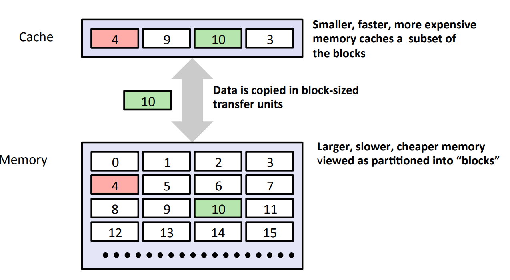
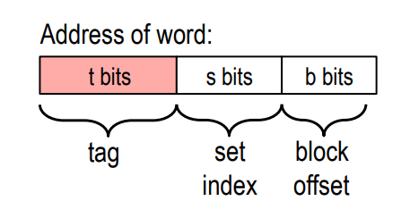
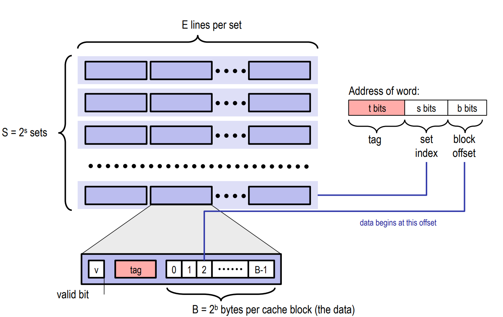
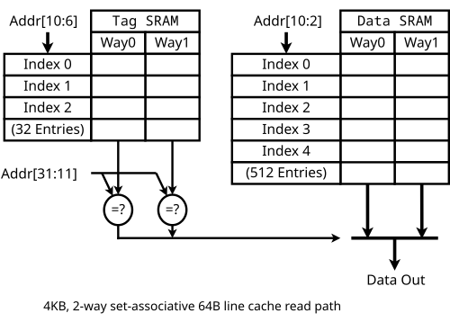
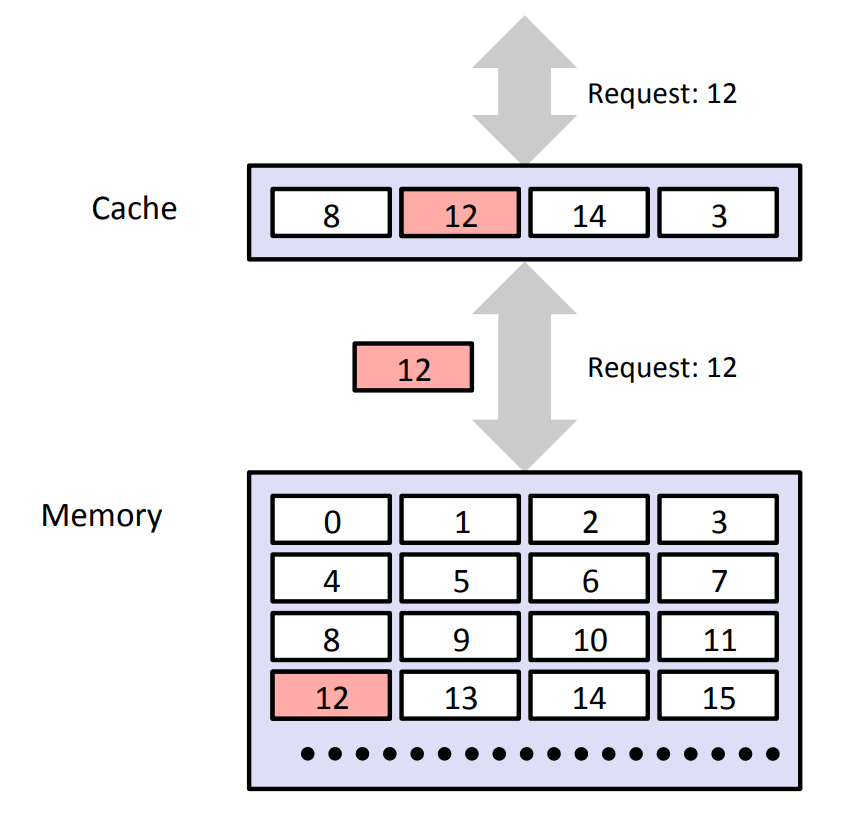
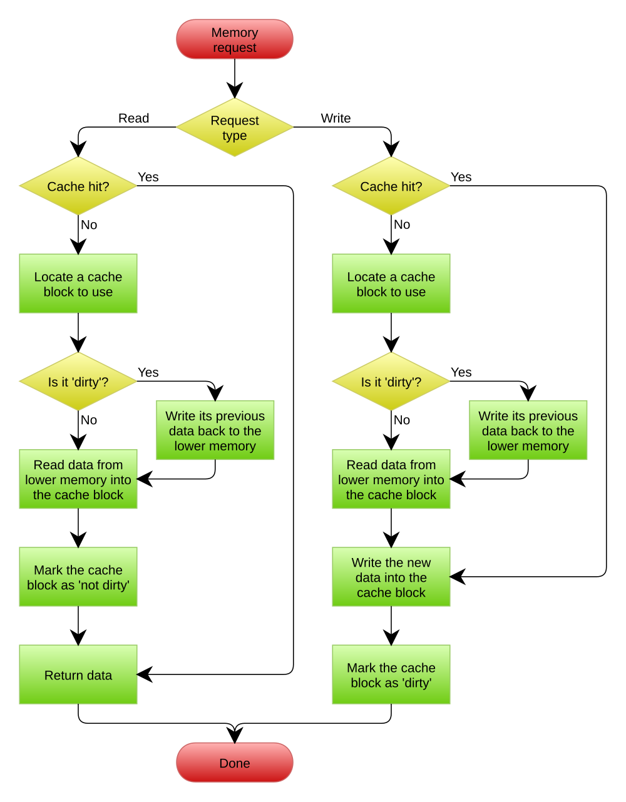
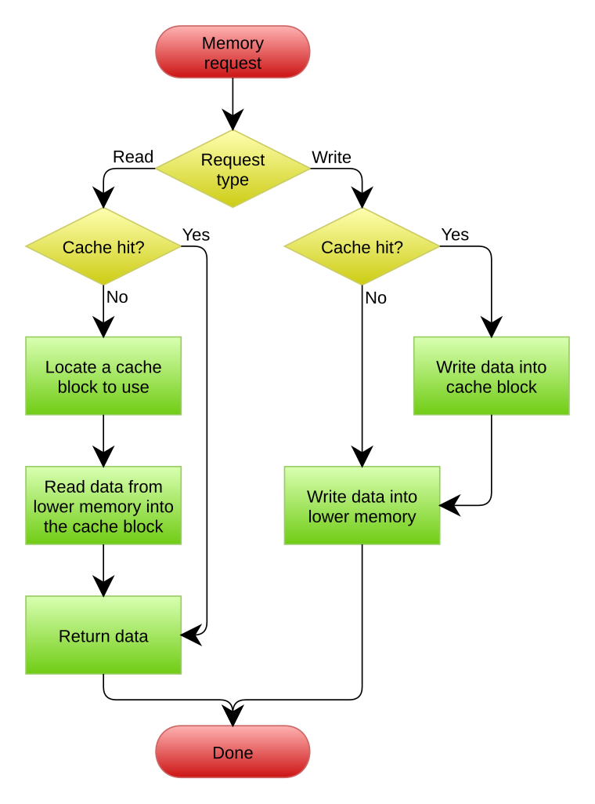
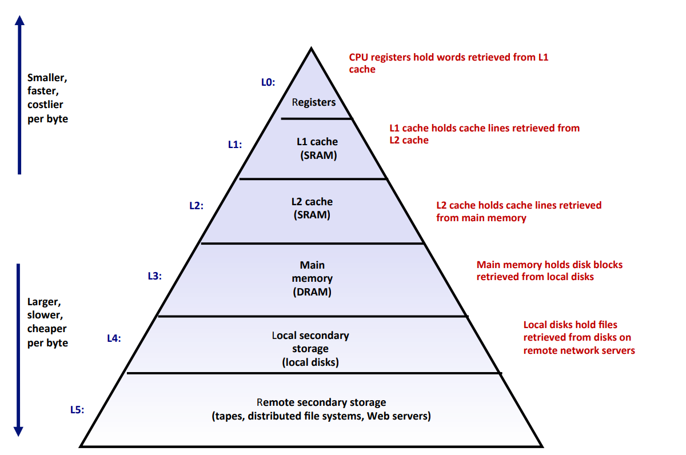
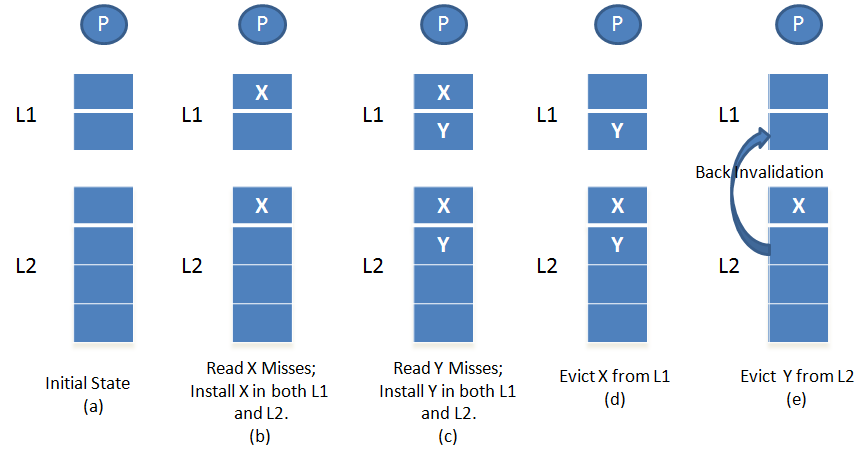

# XJTU-ICS Lab 4: Cache Lab

> *"Raise your quality standards as high as you can live with, avoid wasting your time on routine problems, and always try to work as closely as possible at the boundary of your abilities. Do this, because it is the only way of discovering how that boundary should be moved forward."*

> *— Edsger W. Dijkstra*

## 前言

Welcome to Cache Lab 😉

开课之前，助教组对修过 2025 年 ICS 课程的同学做了一次小调研。当被问到"哪个 Lab 让你印象最深"时，几乎所有人都不约而同地提到了 Cache Lab——对亲手实现三级 Cache 模拟器的难度，至今心有余悸。

这并不奇怪。相较于前三个 Lab 对计算机基础知识（位表示、GDB 调试、逆向分析）的考察，Cache Lab 更侧重于工程代码能力的锤炼：**如何写出一个简洁、优雅且 bug-free 的程序**，是这个实验最核心的挑战。

也许这是你第一次面对真正具有工程复杂度的编程任务；也许你会被一次次的 Error 折磨到夜不能寐；也许你曾动过"走捷径"的念头——但请记住，**big brother is watching you** 🫵

然而有意思的是，当被追问"为什么对 Cache Lab 印象深刻"时，许多同学不约而同地提到了另一个词：**成就感**。

或许是完全理解三级 Cache 运行机制后的豁然开朗，或许是第一次独立写出大型 bug-free 程序时的如释重负，又或许是看着自己精心设计的代码优雅地 scale 起来时难以言说的满足。

我们希望你也能体验到这种成就感。为此，我们希望：

- 独立完成这个实验，不借助任何代码生成工具（Claude Code、Codex 等）
- 深入理解三级 Cache 的工作原理及其对程序性能的影响，能够权衡不同访问方式的 trade-off
- 在实现模拟器的过程中，感受到精心设计所带来的简洁之美
- 完成后，你可以自豪地将"独立实现三级 Cache 模拟器"写入简历，并有能力将其扩展至更复杂的场景（如多核一致性）

最重要的是，我们希望这段经历能成为你的一种底气。当你在未来的学习或工作中，遭遇更复杂、更晦涩的工程挑战时——无论是十万行的代码库，还是从未见过的系统架构——完成 Cache Lab 的记忆会告诉你：**你曾经做到过**☺️

现在，带着对难度的敬畏，带着对自己的信心，出发吧。

## 实验简介

这个实验的目的是为了让大家在学习课堂理论知识的基础上，更好地理解Cache的运行过程以及Cache对于程序运行性能的影响。

本次实验由两部分构成：

- **Lab4A**，总共500分。Part A要求大家使用C语言实现一个**三级Cache模拟器**。实现模拟器并逐渐做到Bugfree的过程会让你加深对Cache基本结构，多级cache的设计和访问方式以及系统设计中的trade-off的理解。

- **Lab4B**，总共100分。Part B要求大家**优化矩阵转置的函数**，这个部分的目标是使我们的代码跑的尽可能的快。不断减少Cache Miss次数的过程会帮助你理解Cache对程序运行性能的重要作用。

!!!warning
    Lab4A和Lab4B都是必做实验

## 注意事项

- 这是一个 **个人** 作业，请大家独立完成。

- 实验可能比较有难度，please **start early** and **ask more**

- 上交的代码文件请注意一定不要有编译问题。**0 Warnings的程序**（那肯定更不能有error）才会帮助你顺利获得属于你的分数。

- **不要在piazza上寻求同学或者直接私聊助教帮你debug**，有关要求帮忙debug的内容我们有权利不回答。

- **禁止使用打表的方式完成实验**，一旦被发现，你将收到课程组准备的"惊喜" ☠️

- 不要抄袭同学的代码，本次实验会有**严格的查重机制**

- 文本中使用的**较高级cache**指**靠近CPU**的cache，而**较低级cache**指**靠近内存**的cache。比如，对于L2和L3 cache，则L2是较高级cache, L3是较低级cache

## 实验环境准备

前置要求：学习完[lab0](./lab0.md)，**不要尝试在windows环境下完成实验**

Linux is all you need

### 远程开发

???todo
    更新获取文件方式@blowinding

使用远程开发的同学，可以登陆任意一台ics服务器完成实验，成功登陆之后在自己的**家目录**
底下可以看到名为**cachelab-sp26**的目录。进入目录，就可以开始实验啦~

如果你缺少这个目录，有下面几种解决方式

- 下载实验压缩包[cachelab-sp26.tar](../assets/files/cachelab-sp26.tar)
- 访问本次实验的[公有仓库](https://github.com/xjtu-ics/cachelab-sp26)并clone到本地（推荐）
- 询问助教或者同学发给你（不推荐）

### 本地开发

本次实验也可以使用本地开发的方式进行，使用本地开发请确保环境中有以下工具

- gcc
- make
- gdb (也许有用)

实验材料的获取方式：

- 下载实验压缩包[cachelab-sp26.tar](../assets/files/cachelab-sp26.tar)
- 访问本次实验的[公有仓库](https://github.com/xjtu-ics/cachelab-sp26)并clone到本地（推荐）
- 询问助教或者同学发给你（不推荐）

## 实验前置知识

本实验与Cache强相关，所以我们首先从总体上带大家来梳理一下Cache相关的知识。

这部分包含两个模块，第一个模块带大家复习cache基本结构和一些基本统计量，包括cache line的结构，set的组织方式，cache hit/miss的定义等等。

第二部分简要讲解有关多级cache的组织方式，以及访问流程等等。

如果你认为自己对于这部分的内容已经完全掌握了，可以跳过这一节，直接开始实验~ 💪

### Cache基础知识

一般而言，Cache是一个**小而快速**的存储设备，它负责存放下一级**更大、更慢**的存储设备的数据的子集（关于子集的要求其实也不严格，具体见后文**多级cache的包含准则**）。使用cache的过程称为Caching。

Cache的原理图如下：



!!!note
    虽然课程中主要讲述的是**CPU中的cache（高速缓存）**，其作为**内存的cache**，但cache实际上是一个十分宽泛的概念，任何小而快的存储设备都可以看作是更大且更慢的设备的cache，其核心是利用**空间局部性**和**时间局部性**。比如内存实际上可以作为磁盘的cache，这在后续的虚拟内存章节也会更加细致的讲述，亦或是使用Redis作为数据库的cache。总而言之，cache的概念在系统设计中非常重要，需要同学们深入理解和掌握。


在cache中，最基本的单位是cache line。任何不同的cache结构，都是将cache line以不同的方式组织起来，其中主要包括**组相联（set associative）**，**直接映射（direct mapped）**和**全相联（fully associative）**三种组织方式。其中后两种组织方式都可以看作第一种组织方式的特殊形式。下面，我们将围绕这些部分重点进行讲解。

#### cache line

每个 cache line 由三部分构成：

- **有效位（Valid Bit）**：标识当前 cache line 是否存有来自主存的有效数据。
  当有效位为 `0` 时，无论该 cache line 中存储了什么内容，都应当被忽略——
  这通常发生在 Cache 刚上电初始化、还没有从主存加载任何数据的时候。

- **标记（Tag）**：记录当前 cache line 所缓存的数据来自主存的哪个地址（的高位部分）。
  CPU 访问 Cache 时，会将请求地址中的 Tag 字段与 cache line 中存储的标记进行比对，
  以此判断目标数据是否恰好缓存在这一行中。

- **数据块（Block）**：主存中某段连续内存的完整副本，是 cache line 真正存储数据的部分，
  大小固定为 $B = 2^b$ 字节。

那么，CPU 在访问 Cache 时，是如何利用这三个字段完成查找的呢？

为了支持这一查找过程，Cache 将 CPU 发出的每一个内存地址拆分成**三个字段**，
分别对应 cache line 中的三个组成部分：

<figure markdown>
  
</figure>

- **组索引（Set Index）**，共 $s$ 位：用地址的这一段直接定位到 Cache 中的某一个组，
  Cache 共有 $S = 2^s$ 个组，编号从 $0$ 到 $S-1$。
  这一步缩小了搜索范围——我们只需要在这一个组内继续查找。

- **标记（Tag）**，共 $t$ 位：进入目标组之后，将地址中的 Tag 字段与组内每个
  cache line 存储的标记逐一比对。由于同一个组可能先后缓存过来自不同地址的数据，
  Tag 就是区分"当前 cache line 存的到底是哪块内存"的唯一依据。

- **块偏移（Block Offset）**，共 $b$ 位：确认命中之后，用这一段精确定位目标数据
  在 cache line 数据块内部的起始字节位置。

三个字段加起来恰好覆盖完整的地址位宽：$t + s + b = 地址总位数$。

#### Cache 基础结构

在逻辑上，Cache 可以看作由 cache line 组成的一个**二维数组**，这也是最通用的
**组相联（Set Associative）** 结构，如下图所示：



这个二维数组的**行数**决定了 Cache 被分成多少个**组（Set）**，用 $S$ 表示；
**列数**决定了每个组内能容纳多少个 cache line，称为**相联度（Associativity）**，用 $E$ 表示。
例如，若每个组内包含 8 个 cache line，则称该 Cache 为 **8 路组相联（8-way Set Associative）**。

组相联结构可以向两个极端方向演化：

- **增加列数（提高相联度）→ 全相联（Fully Associative）**:当整个 Cache 只有一个组（$S=1$）时，所有 cache line 都属于同一组，任何内存数据块都可以被放入 Cache 中的任意位置。这种结构灵活性最高，冲突缺失最少，但查找时需要与所有 cache line 逐一比对 Tag，硬件开销随容量增大而急剧上升，因此仅适用于容量较小的场景。

- **减少列数（降低相联度）→ 直接映射（Direct Mapped）**:当每个组内只有一个 cache line（$E=1$）时，每个内存数据块都被唯一地映射到某一个固定的组，没有任何选择的余地。这种结构硬件实现最简单，查找速度最快，但容易因多个地址争抢同一位置而产生冲突缺失（Conflict Miss），在某些访问模式下性能会显著下降。

组相联正是二者的折中：组间采用直接映射（地址决定进哪个组），组内采用全相联（该组中任意 cache line 均可存放数据），在灵活性与硬件复杂度之间取得平衡，因此被现代处理器广泛采用。

!!!note
    Cache line 是 Cache 内部，以及 Cache 与内存之间进行数据交换的**最小传输单位**。每个 cache line 存储一个**数据块（Block）**，大小通常为 64 字节，也有 32 字节或 128 字节等变体，具体取决于处理器的设计。值得注意的是，在实际的硬件实现中，cache line 中的**数据块（Data Block）**和**标记字段（Tag）**通常存放在两块相互独立的 SRAM 存储阵列中，分别称为 **Data SRAM** 和 **Tag SRAM**。
    <figure markdown>
        
    </figure>

    这样设计的原因在于两者的访问方式截然不同：Tag 字段体积小、需要快速比对，而 Data Block 体积大、只有在 Tag 命中后才需要读取。以常见的 N 路组相联 Cache 为例，CPU 访问时会**并行**读取所有路的 Tag 进行比较，确认命中后再从对应的 Data SRAM 中取出数据；而 L2 Cache 有时会选择**先读 Tag、再读 Data** 的串行方式，以节省功耗。

    将 Tag 与 Data 分开存储，正是为了让这两种不同的访问模式都能得到最优的硬件支持。

    你可能会问：**cache line 为什么不直接以 CPU 的字长（8 字节）作为传输单位呢？**

    这要从 CPU 的工作方式说起。正如课本前几章所介绍的，CPU 内部的数据处理以**字**为单位——对于常见的 64 位 CPU，一次处理的数据大小为 64 位，即 8 字节，寄存器宽度也是如此（部分 SIMD 指令会用到 128 位或 256 位的宽寄存器，属于特殊情况）。

    然而，cache line 的大小往往远大于 CPU 字长，这背后有两个主要原因：

    1. **利用空间局部性：** 程序访问某个内存地址后，很大概率会紧接着访问其附近的地址。因此，每次将一片连续的内存数据整块加载到 Cache 中，对于具有良好空间局部性的程序来说，能够显著减少后续的 cache miss，从而提升性能。

    2. **均摊传输开销：** 内存总线的每次传输都存在固定的启动开销（如寻址、延迟等）。一次性传输一整块数据，可以把这些开销分摊到更多字节上，比每次只取 8 字节要高效得多。这也是为什么 cache line 的大小通常与内存的**突发传输长度（Burst Length）**对齐，而现代 DRAM 的突发传输大小恰好也是 64 字节。对 DRAM 内存结构和时序感兴趣的同学，可以自行搜索进一步了解，这里不再展开。

    在 CPU 实际访问数据时，通常是将 cache line 中对应的 8 字节数据加载到寄存器，再进行运算；而当 Cache 与内存之间需要交换数据时，则以整个 cache line（64 字节）为单位进行传输。

#### Cache 相关统计量

下面结合图示，介绍 Cache 的三个核心统计量——**Cache Hit**、**Cache Miss** 和
**Cache Eviction**——的含义，以及每种情况下 Cache 实际执行的操作。



当 CPU 需要访问某个数据对象 $d$ 时，会首先在 Cache 中查找。
根据查找结果的不同，会出现以下三种情况：

1. **Cache Hit（命中）**

    如果 Cache 中恰好缓存了数据对象 $d$（如图中访问数据 8 的情况），则称为 **Cache Hit**。
    此时 CPU 可以直接从 Cache 中读取数据，**无需访问主存**，从而节省了大量的访问时间。

2. **Cache Miss（缺失）**

    如果 Cache 中没有缓存数据对象 $d$ 所在的数据块（如图中访问数据 12 的情况），
    则称为 **Cache Miss**。此时 Cache 控制器会执行以下操作：

    1. 向主存发起请求，取回包含 $d$ 的完整数据块；
    2. 根据地址中的 Set Index 定位到对应的 Cache Set；
    3. 若该 Cache Set 中存在空闲的 cache line（即 Valid Bit 为 `0`），
       则将数据块写入该行，并更新 Tag 字段和 Valid Bit。

3. **Cache Eviction（替换）**

    如果在处理 Cache Miss 的过程中，目标 Cache Set 内**所有** cache line 均已被占用
    （没有 Valid Bit 为 `0` 的空闲行），则必须先驱逐其中一行，腾出空间后再写入新数据块，
    这一过程称为 **Cache Eviction**。

    至于驱逐哪一行，由 Cache 的**替换策略**决定。最常见的是
    **LRU（Least Recently Used，最近最少使用）策略**：
    优先淘汰组内**距上次访问时间最长**的那一行——
    其背后的直觉是"越久没被用到的数据，将来被再次用到的可能性也越低"。

!!! note "三种情况的关系"
    Cache Miss 和 Cache Eviction 并不是并列的两种独立情况——
    **Eviction 是 Miss 的一个特殊子情况**：只有在发生 Miss、
    且目标 Cache Set 已满时，才会触发 Eviction。

#### 如何处理写操作

cache处理写操作的流程比读取要复杂，因为写入操作涉及**数据的更改**，一旦涉及修改操作，就会带来各种一致性问题，因此cache需要合理的处理数据更改的时机和范围。同时还需要处理写miss的情况。我们在这里简要介绍一下有关写cache的一些问题和处理机制。

一般而言，对于写入操作，cache一般有两种处理机制，分别是：

- **write back（写回）**：即数据的修改只发生在当前这一级cache中，通常会引入一个**dirty**标记位，表示cache中的数据和下一级存储（L2 Cache 或主存）中的数据**不一致**，只有在当前的cache line被evict的时候才会将数据写回到下一级存储（L2 Cache 或主存）。
- **write through（写直达）**：顾名思义，写入操作会同时将数据写入到当前cache和下一级存储（L2 Cache 或主存），因此二者的数据是同步的。

除了上述的两种策略，cache还需要确定如何处理write miss的情况，一般而言，也有两种方法：

- **write allocate（写分配）**：当发生 cache miss 时，Cache 控制器会向下一级存储（L2 Cache 或主存）发起请求，将包含目标数据的完整数据块加载到当前 cache line 中，随后 CPU 再从中读取所需的数据。
- **no write allocate（写不分配）**：当发生 cache miss 时，CPU 的写入数据会被直接提交到下一级存储（L2 Cache 或主存），当前 Cache 中的内容无需做任何改动。

上述策略两两组合可以产生4种不同的写策略，但是一般常见的只有以下两种：

- **write back/write allocate**：即写回+写分配策略
- **write through/no write allocate**：即写直达+写不分配策略

大家可以自己思考一下为什么另外两种搭配方式不常见。🤔

有关write back/write allocate的写入流程如下（图源自[wiki: cache write policy](https://en.wikipedia.org/wiki/Cache_(computing))）：



有关write through/no write allocate的写入流程如下（图源自[wiki: cache write policy](https://en.wikipedia.org/wiki/Cache_(computing))）：



!!!note
    实际上，在现代的CPU中，几乎每一级cache都使用的是write back/write allocate策略，而write through策略只在早期AMD的CPU上的L1D cache使用过。

    write through策略的优点是数据一致性的维护较为简单，但每次写操作都需要同步更新下一级存储，这会带来大量的总线流量。而访问下一级存储（尤其是主存）相对 CPU 而言是一个较慢的操作，频繁的写请求很容易成为性能瓶颈。

    为了缓解这一问题，采用写直达策略的 Cache 通常会额外引入一块**写缓冲区（Write Buffer）**：CPU 的写请求先快速写入写缓冲区即可返回，由写缓冲区在后台异步地将数据刷新到下一级存储，从而将 CPU 与缓慢的内存写操作解耦。

    write back策略不会带来大量的总线流量，因此性能较好，但是会产生数据一致性问题，因此需要更复杂的机制来保证数据一致性。不过随着技术的发展，write back策略带来的收益已经超过write through策略带来的收益，因此write through已经逐渐被淘汰了。

### 多级Cache
<!-- ???todo
    感觉这里的组织逻辑不是很通顺，可以单独起一节来讲多级cache,包括后面两小节，需要具体优化@rouge3877 -->

现代计算机系统中，CPU内部往往不会仅采用一级cache，而是使用多级cache结构，以**优化最坏情况（从内存访问）下的性能**。但是多级cache结构的组织又会引入很多的问题，因此本节将讲解多级Cache的典型结构以及各级Cache之间的数据管理策略，希望这些知识能够帮助你更好的完成Part A实验（三级Cache模拟器）。

#### Memory Hierarchy

在真实的计算机系统中，CPU与内存乃至于外围设备之间存在着巨大的速度鸿沟：现代CPU执行一条指令可能只需要不到1纳秒，而一次内存访问却需要约100纳秒，二者相差约**两个数量级**。这里有一个[可交互式的网页](https://colin-scott.github.io/personal_website/research/interactive_latency.html)可以帮助大家更直观地感受不同年代CPU指令运行、访问Cache以及访问内存等操作之间的速度差距。

由于不同存储技术的访问时间差别很大，但速度较快的技术每字节的成本要比速度慢的技术高，而且容量小。因而现代计算机系统往往采用存储器层次结构的方法，这是计算机系统设计中的一个重要思想——**存储器层次结构（Memory Hierarchy）**。下图展示了一个典型的存储器层次结构：



存储器层次结构的中心思想是：对于每个k，位于第k层的更快更小的存储设备，作为位于第k+1层的更大更慢的存储设备的cache。即每一层cache的内容均来自于较低一层的数据对象。例如图中，SRAM作为DRAM的cache；而DRAM本身又是磁盘的cache（这一点在后续虚拟内存章节会详细讲述）。

多级Cache也正是基于这样的设计思想。由于CPU执行和内存访问之间的速度差距越来越大，因此需要将一系列**由小到大、由快到慢**的Cache逐级排列，让每一级Cache都充当下一级的"缓冲层"。

- **L1 Cache**：最小（通常32-64KB）但最快（1-4个时钟周期），追求**极致的访问延迟**
- **L2 Cache**：中等大小（通常256KB-1MB），访问延迟约10个周期，目标是**过滤掉L1的大部分Miss**
- **L3 Cache**：最大（通常几MB-几十MB），访问延迟约30-40个周期，目标是**尽可能避免访问主存**
- **主存（DRAM）**：容量最大（几GB-几十GB），但访问延迟高达约100-200个周期

我们可以通过**平均内存访问时间（AMAT）**来衡量多级Cache的效果：

$$
AMAT = t_{L1} + MissRate_{L1} \times (t_{L2} + MissRate_{L2} \times (t_{L3} + MissRate_{L3} \times t_{Mem}))
$$

其中 $t$ 代表访问延迟，$MissRate$ 代表不命中率。可以看出，即使L1的Miss率不低（比如5%），只要L2和L3能够过滤掉绝大部分剩余的Miss，最终到达主存的访问比例就会非常小，AMAT就能接近 $t_{L1}$。这正是多级Cache的意义所在。

#### 多级Cache的典型结构

在现代处理器中，多级Cache的组织方式有一些通用的设计模式。

**L1 Cache的分离设计（Split Cache）**

L1 Cache通常被分为两个独立的部分：

- **L1I（Instruction Cache）**：专门缓存**指令**，只读或可读可写
- **L1D（Data Cache）**：专门缓存**数据**，可读可写

为什么要在L1这一级做分离？这与CPU的**流水线设计**密切相关。在一个流水线处理器中，**取指令（Fetch）**和**访问数据（Memory Access）**发生在不同的流水线阶段。如果指令和数据共用同一个Cache，这两个阶段就无法同时进行——它们会争夺同一个Cache端口，产生**结构冲突（Structural Hazard）**。将L1分为I-Cache和D-Cache，就允许CPU在**同一个时钟周期内同时取指令和读写数据**，从而提高流水线的吞吐率。

**L2/L3 Cache的统一设计（Unified Cache）**

从L2开始，Cache通常是**统一（Unified）**的，即同时存储指令和数据。因为在L2及以下层级，访问延迟本身已经较高，流水线结构冲突已不是主要瓶颈；而统一设计可以更**灵活**地利用Cache容量——如果某个程序是数据密集型的，Unified Cache自然会将更多空间分配给数据，反之亦然。

!!!note
    在实现三级Cache模拟器时，L2和L3是Unified Cache这一特性意味着：**L1D的数据和L1I的指令可能共存于同一个L2 cache set中**。在处理Back Invalidation（后面会讲到）时，你需要同时检查L1D和L1I，这是一个容易遗漏的细节。

一个容易被忽略但十分重要的细节是：**不同层级可以有不同的Cache Line大小**。例如在本次实验中，L1和L2的cache line大小是8字节，而L3的cache line大小是16字节。

这意味着，同一个内存地址在不同层级的Cache中，其 $tag$、$set\ index$、$block\ offset$ 的划分方式是**不同的**——因为 $b$（block offset位数）和 $s$（set index位数）在各级Cache中可能不同，进而影响 $t$（tag位数）。在实现多级Cache模拟器时，这一点需要格外注意。

#### 多级Cache之间的数据管理

!!!danger
    这一部分在课程中可能讲述较少，同时与实验内容**强相关**，因此强烈建议仔细阅读本节。如果你有任何困惑，可以上piazza提问并讨论，或者自行google相关wiki和他人写的博客进行学习。

当多级Cache层层嵌套时，一个关键的问题是：**各级Cache中存储的数据之间，应该保持什么样的关系？**

这个问题被称为**包含准则（Inclusion Policy）**，它是多级Cache设计中必须确定的一个基本因素。主要存在三种策略：

**Inclusive Policy（包含性策略）**

所有存在于高层Cache（靠近CPU）中的数据，**一定**也存在于低层Cache（靠近内存）中。换言之，L1的内容是L2的子集，L2的内容是L3的子集。你可以把内存看作一个最大的"全集"，包含所有数据。

这就像一个层级图书馆系统：你桌上的书（L1）一定在你的书架上（L2）也有一份，而你书架上的书一定在图书馆（L3）也有一份。

**Exclusive Policy（排他性策略）**

任何一条数据**只存在于某一级Cache中**，不会在多级Cache中同时出现。当数据从L2加载到L1时，L2中的那份副本会被移除。这种策略的优点是整个Cache层次结构中没有数据冗余，等效总容量最大。

**Non-Inclusive-Non-Exclusive（NINE）策略**

对数据在各级Cache中的存在性不做任何严格约束，各级Cache独立管理自己的内容。这是实现上最简单的方式，但也放弃了上述两种策略所提供的结构性保证。

!!!note
    三种策略各有优劣，体现了系统设计中永恒的**trade-off**。Inclusive策略便于维护一致性（要判断某个数据是否在Cache层次中，只需查看最低一级的Cache即可），但代价是高层Cache的数据在低层Cache中有冗余副本，浪费了一部分宝贵的Cache空间。Exclusive策略最大化了等效Cache容量，但数据的搬迁逻辑更复杂。NINE策略最灵活但缺乏可利用的结构性保证。想了解更多，可以查阅[wiki: cache inclusion policy](https://en.wikipedia.org/wiki/Cache_inclusion_policy)。

**在本次实验中，你需要实现的是Inclusive Policy。** 下面我们深入讲解这种策略下的访问规则。

#### Inclusive Policy的访问规则

考虑一个二级缓存结构（L1 + L2），这里借用[wiki: cache inclusion policy](https://en.wikipedia.org/wiki/Cache_inclusion_policy)上的一张图来表示：



为了**始终保证 "L1 ⊆ L2" 这一不变量**——即L1中的每一条有效数据，在L2中也一定存在——各种Cache操作需要遵循以下规则：

1. **L1 Hit**：直接返回数据，无需访问L2。由于L1中有这条数据，而inclusive保证L2也一定有，不变量自然满足。

2. **L1 Miss, L2 Hit**：从L2取出对应的cache line，并将其**复制一份到L1**中。如果L1需要evict一条cache line来腾出空间，这个evict过程**不影响L2**——被L1淘汰的数据仍然安全地保存在L2中（因为inclusive保证它一定在L2中），不变量依然成立。

3. **L1 Miss, L2 Miss**（需要从内存加载）：必须将数据**同时加载到L2和L1中**。如果只加载到L1而不加载到L2，就会出现"L1中有但L2中没有"的情况，直接违反inclusive性质。

4. **L2 Eviction触发Back Invalidation**：当L2需要evict一条cache line时，**必须同时检查L1中是否也有这条数据**。如果有，必须将L1中的对应cache line也一并evict（清除valid位）。这个过程叫做**Back Invalidation（回溯失效）**。如果L2中的数据被替换而L1中的副本却保留了下来，就会出现"L1中有但L2中没有"的情况——这直接违反了inclusive性质。


## 开始实验
<!-- ???todo
    需要修改具体实验目录@blowinding -->

首先进入实验目录`cachelab-sp26`，然后运行`ls`查看文件：

```bash
$ cd cachelab-sp26
$ ls
cache-impl.c  csim-ref-partA  test-csim              traces-hard/      traces-mixed/
cachelab.c    csim-ref-partB  test-trans.c           traces-l1-basic/  trans.c
cachelab.h    driver.py       tracegen.c             traces-l2-basic/
csim.c        Makefile        traces-data-intensive/  traces-l3-basic/
```

你可以尝试运行`make`进行编译：

```bash
$ make
gcc -g -Wall -Werror -m64 -o csim csim.c cachelab.c cache-impl.c
gcc -g -Wall -Werror -m64 -O0 -c trans.c
gcc -g -Wall -Werror -m64 -o test-trans test-trans.c cachelab.c trans.o
gcc -g -Wall -Werror -m64 -O0 -o tracegen tracegen.c trans.o cachelab.c
```

此时再次运行`ls`，得到的输出如下：

```bash
$ ls
cache-impl.c  csim.c          Makefile      tracegen               traces-l1-basic/  trans.c
cachelab.c    csim-ref-partA  test-csim     tracegen.c             traces-l2-basic/  trans.o
cachelab.h    csim-ref-partB  test-trans    traces-data-intensive/  traces-l3-basic/
csim          driver.py       test-trans.c  traces-hard/            traces-mixed/
```

下面是对于实验文件的详细解释：

- `cachelab.h/cachelab.c`：包含了本次实验的一些helper function
- `cache-impl.c`：cache模拟器的源文件，是在**Part A中唯一需要修改**的文件
- `csim.c`：cache模拟器的入口文件，助教们在这个文件中帮大家实现好了主要的处理逻辑
- `csim-ref-partA`：参考cache模拟器，可以与自己的实现进行比对，将在Part A中使用
- `test-csim`：用于Part A测试的文件
— `traces-*`：六个目录，用于存放在Part A中用于测试的文件
- `csim-ref-partB`：在Part B中使用的cache模拟器
- `trans.c`：Part B中你需要修改的文件
- `tracegen.c`：生成`tracegen`的源文件
- `tracegen`：Part B中用于生成trace的可执行程序
- `test-trans`：测试Part B部分的可执行文件
- `driver.py`：用于测试Part A + Part B总得分的脚本

## 评分方法

- Part A 500分
- Part B 100分

最终得分的计算公式为：
$score_{total} = score_{Lab4A} \div 5 \times {0.8} + {score_{Lab4B}} \times {0.2}$

和往常一样，我们将最终用于评分的`driver.py`脚本也分发给了大家，大家可以用于快速自测分数，使用方法如下：

```shell
$ make
$ python3 driver.py
```

或者：

```bash
$ make
$ make grade
```

!!!note
    先`make`保证当前你的可执行文件已编译为你最新的提交版本

通常来说你会获得类似如下的输出：（这是一个满分输出）

```shell
$ make grade
python3 ./driver.py
Part A: Testing cache simulator
Running ./test-csim

========== Testing cache level 1 ==========

...

========== Testing cache level 2 ==========

...

========== Testing cache level 3 ==========

...

Testing cache simulator done. Total scores: 500 / 500
Totally 4.447192 seconds passed.

Part B: Testing transpose function
Running ./test-trans -M 32 -N 32
Running ./test-trans -M 64 -N 64
Running ./test-trans -M 61 -N 67

Cache Lab summary:
                        Points   Max pts      Misses
Csim correctness         500.0       500
Trans perf 32x32          30.0        30         288
Trans perf 64x64          30.0        30        1108
Trans perf 61x67          40.0        40        1914
Total points (weighted)   100.0       100
```

如上分别是各个部分的组成，最后几行会输出你的总成绩。你可以通过如上方法快速得知你最终会得到多少的分数。

## 代码提交

Lab4A和Lab4B有不同的提交入口，在 `cachelab-sp26` 目录（也就是你的实验目录）下执行 `make submit` 命令，会生成两个压缩文件，分别为 `<userid>-handin-4A.zip` 和`<userid>-handin-4B.zip`，分别将你的`cache-impl.c`文件和`trans.c`文件压缩。（其中 `<userid>` 为`你的学号-ics`，也就是ICS Server中你的用户名）。

在[在线学习平台](http://class.xjtu.edu.cn/)上的作业模块中，将该文件作为附件提交即可。

!!!note
    提交网站可能会自动加上（2）等后缀以区分多次提交，这种情况无需担心，下载会自动以**最后一次提交**为准。如果你觉得不舒服，可以命名为例如`<userid>-cachelab-handin.zip`。文件命名不会影响到最后的成绩。

### 迟交
???todo
    需要修改迟交策略@blowinding

在超过原定的截止时间后，我们仍然接受同学的提交。此时，在lab中能获得的最高分数将随着迟交天数的增加而减少，具体服从以下给分策略：

- 4.14 - 4.20（含），每天扣除1%的分数，双休日不扣分，也就是最多扣除5%。
- 4.21 - 4.26（含），由于**概率论考试**，不扣分。
- 4.27（调休） - 5.11（含），其中：4.27 - 4.30（含）以及5.6 - 5.8（含）每天扣除2%的分数，也就是最多扣除14%。五一放假不扣分，5.9 **算法考试**，不扣分，5.10 - 5.11，双休日不扣分。
- 5.11及以后，每天扣除7%的分数，直至扣完

以上策略中超时不足一天的，均按一天计，自ddl时间开始计算。届时在线学习平台将开放迟交通道。

---

Copyright © 2026 XJTU ICS-TEAM

