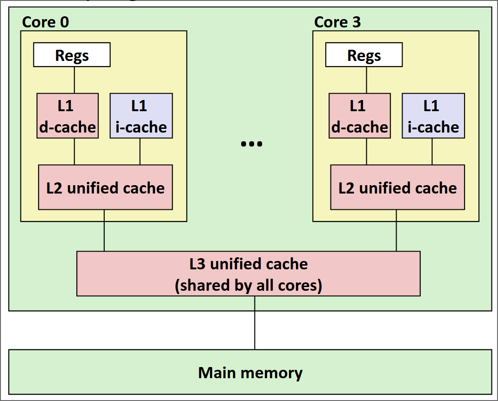
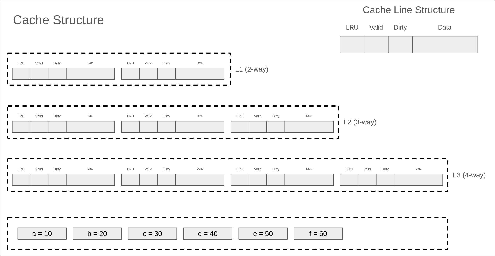

# Part A：三级Cache模拟器

在Part A中，你需要实现一个三级Cache模拟器，这个模拟器将会读取`traces-*`目录下的trace文件，然后开始运行，从而达到模拟cache访问的效果。

## 三级缓存结构的基本配置

本次实验中，需要实现的三级cache结构如下：



其中：

- L1分为L1D（数据读写）和L1I（指令读取）两个分离的cache，并且L1I是**只读**的。
- L1和L2为**每个核心私有**
- L2为unfied cache，也就是会**同时存储指令和数据**
- L3为unfied cache，且**所有核心共享**

!!!note
    上述结构实际上就是真实CPU内部的多级cache结构，但是本次实验中，**你可以假设所有指令都是one by one执行**，且**只有一个核心**。换句话说，你**无需考虑多线程并发访问和核心之间缓存一致性**的问题。

每个cache的具体配置如下：

- L1D(I) cache
    - size: 64B
    - set: 4
    - associativity: 2-way
    - cache line size: 8B
    - write policy: write back + write allocate
- L2 cache
    - size: 256B
    - set: 8
    - associativity: 4-way
    - cache line size: 8B
    - write poliy: write back + write allocate
    - inclusion policy: inclusive
- L3 cache
    - size: 2KB
    - set: 16
    - associativity: 8-way
    - cache line size: 16B
    - write policy: write back + write allocate
    - inclusion policy: inclusive

!!!warning
    再阅读下一部分之前，请确保自己已经**完全理解**上述cache配置中的每一行配置要求。如果你感受到任何的困惑，建议立即停止并且阅读**实验前置知识**一节。

## Trace文件简介

在`cachelab-sp26`目录下的`traces`目录中有许多以`.trace`结尾的文件，我们称它们为trace文件。trace文件中是一系列访存日志，它作为Part A中Cache模拟器的输入，用来判断程序的正确性。trace文件是通过`Valgrind`工具生成的。

!!!note
    `Valgrind`是一款用于内存调试、内存泄漏检测以及性能分析的软件开发工具。

例如：

```shell
$ valgrind --log-fd=1 --tool=lackey -v --trace-mem=yes ls -l
```

以上命令可以输出执行`ls -l`命令时实际产生的所有内存访问日志。

trace文件的格式如下：

```plain
I 0400d7d4,8
 M 0421c7f0,4
 L 04f6b868,8
 S 7ff0005c8,8
```

每一行代表一个内存访问指令，每个指令可能会有一次或两次的内存访问，每一行的格式如下：

```plain
[space]operation address,size
```

- `operation`表示内存访问指令的类型，分为4种：
  - `I`表示一条指令的加载（Instruct）
  - `L`表示数据读取（Load）
  - `S`表示数据存储（Store）
  - `M`表示数据修改（Modify）（**实际上是一次Load再加一次Store**）
- `address` 表示一个64位**十六进制**内存地址。
- `size`表示本次内存访问的字节数。

!!!note
    **注意**：在trace文件中，`I`前面**没有空格**，但是`M`，`L`，`S`前面**一定有一个空格**。

## 实验内容及步骤

???todo
    修改实验步骤，添加新命令行参数`-c`@blowinding

不知道大家在看到实验目录下那么多的文件之后，是否感受到头昏眼花了呢？不过，不用担心，为了减轻同学们的负担，助教们已经将大部分代码框架搭建好了，大家只需要在给定的框架中填充代码即可~

在Part A中，你**唯一需要**完成的文件是`cache-impl.c`文件，除此之外，你**严禁修改其他任何文件，包括删除现有文件或者自行创建新文件**。否则可能造成**本地评测和提交之后的评测结果不一致，或者无法编译通过**，产生的**一切后果由自己承担**。⚠️

正如前面提到的，在Part A中你需要实现一个三级cache模拟器。作为参考标准，我们提供了一个已经正确实现的cache模拟器作为参考标准，以**二进制可执行程序**的形式发放，命名为`csim-ref-partA`。

!!!warning
    假如你缺少这个程序，或者程序损坏无法运行，请立刻联系助教进行处理。

这个程序接受多个命令行参数，可以通过下面这条命令查看其用法：

```bash
$ ./csim-ref-partA -h
usage: ./csim-ref-partA -t trace_file [-h] [-n] [-v] [-l level] [-d] [-i] [-s set] [-b breakpoint] 
options: 
-h, --help          print this
-o, --output        output file
-t, --trace         input trace file (required)
-c, --cache-levels  number of cache levels to build [1-3] (default: 3)
-n, --snapshot      print cache snapshot
-b, --breakpoint    print cache info after one specified access, note that it can not be enabled in verbose mode
-v, --verbose       print information after each cache access, instead of print snapshot at the end
-l, --level         which cache level [l1--1, l2--2, l3--3] to print (only can be specified when [-n] is enabled)
-d, --data          data cache (must be specified if level == 1)
-i, --instruction   instruction cache (must be specified if level == 1 )
-s, --set           which cache set (index start from 0) to print (only can be specified when [-l] is enabled)
```

下面是对上述参数的具体解释：

- `-h`：可选，打印帮助信息
- `-n`：可选， 打印快照信息
- `-o`：可选，指定输出信息的文件路径，默认是标准输出
- `-c`：可选，指定当前构建的最大Cache层级，可选值有`1`、`2`、`3`，默认为`3`
- `-v`：可选，以详细模式打印信息，这种模式下，相关的统计量和快照信息会在每次进行一次cache访问之后打印，默认是全部trace访问完成之后打印。
- `-t`: **必选**，指定输入trace文件的路径
- `-b`：可选，断点功能，将会打印在某一次cache访问之后的cache状态，注意这个参数**不能和`-v`同时使用**

为了测试cache的正确性以及方便大家debug，助教们为大家写好了打印快照的函数，可以打印所有cache line中的tag，valid和dirty字段的值。

打印快照的功能通过`-n`参数开启，默认在完成所有cache访问后，打印所有cache line的信息。

如果你不想要所有的cache line内容，可以在**开启快照之后（即指定了-n参数）**指定打印哪个cache，以及哪个cache的哪个set，这些通过**参数+值**的形式来实现：

- `-l <level>`：可选，指定打印哪一级cache，可选值为[1, 2, 3]，分别代表L1, L2和L3 cache
- `[-d -i]`：可选，分别表示dcache和icache，当level指定为1时，你需要**至少指定一个参数**
- `-s <set>`：可选，指定打印某一个cache set，使用此参数时，你**必须先指定level**

下面是一个典型的运行结果：

```bash
$ ./csim-ref-partA -t traces-l1-basic/l1Devict.trace
L1-d cache hits:0 misses:4 evictions:2
L1-i cache hits:0 misses:0 evictions:0
L2 cache hits:2 misses:3 evictions:0
L3 cache hits:0 misses:3 evictions:0
```

如果只想构建一级Cache：
```bash
$ ./csim-ref-partA -t ./traces-l1-basic/l1Devict.trace -c 1
L1-d cache hits:0 misses:4 evictions:2
L1-i cache hits:0 misses:0 evictions:0
L2 cache hits:0 misses:0 evictions:0
L3 cache hits:0 misses:0 evictions:0
```


使用`-n`开启快照，并且使用`-v`打印详细信息。

```bash
$ ./csim-ref-partA -vnt traces-basic/l1Devict.trace
0: S 0 8
L1-d cache hits:0 misses:1 evictions:0
L1-i cache hits:0 misses:0 evictions:0
L2 cache hits:0 misses:1 evictions:0
L3 cache hits:0 misses:1 evictions:0
l1-d cache[0][0]: valid=1, dirty=1, tag=0
l1-d cache[0][1]: valid=0, dirty=0, tag=0
l1-d cache[1][0]: valid=0, dirty=0, tag=0
l1-d cache[1][1]: valid=0, dirty=0, tag=0
l1-d cache[2][0]: valid=0, dirty=0, tag=0
l1-d cache[2][1]: valid=0, dirty=0, tag=0
l1-d cache[3][0]: valid=0, dirty=0, tag=0
l1-d cache[3][1]: valid=0, dirty=0, tag=0
l1-i cache[0][0]: valid=0, dirty=0, tag=0
l1-i cache[0][1]: valid=0, dirty=0, tag=0
l1-i cache[1][0]: valid=0, dirty=0, tag=0
l1-i cache[1][1]: valid=0, dirty=0, tag=0
l1-i cache[2][0]: valid=0, dirty=0, tag=0
l1-i cache[2][1]: valid=0, dirty=0, tag=0
l1-i cache[3][0]: valid=0, dirty=0, tag=0
l1-i cache[3][1]: valid=0, dirty=0, tag=0
l2 cache[0][0]: valid=1, dirty=0, tag=0
l2 cache[0][1]: valid=0, dirty=0, tag=0
...
l2 cache[7][0]: valid=0, dirty=0, tag=0
l2 cache[7][1]: valid=0, dirty=0, tag=0
l2 cache[7][2]: valid=0, dirty=0, tag=0
l2 cache[7][3]: valid=0, dirty=0, tag=0
l3 cache[0][0]: valid=1, dirty=0, tag=0
l3 cache[0][1]: valid=0, dirty=0, tag=0
l3 cache[0][2]: valid=0, dirty=0, tag=0
l3 cache[0][3]: valid=0, dirty=0, tag=0
l3 cache[0][4]: valid=0, dirty=0, tag=0
l3 cache[0][5]: valid=0, dirty=0, tag=0
...
l3 cache[15][6]: valid=0, dirty=0, tag=0
l3 cache[15][7]: valid=0, dirty=0, tag=0
1: L 20 8
```

这会在每一次访问之后打印具体的**访问指令**，当前的**统计量**和**cache的快照**等。

如果你只对L2感兴趣，可以指定打印L2的某一个set：

```bash
$ ./csim-ref-partA -vnt traces-basic/l1Devict.trace -l 2 -s 4
0: S 0 8
L1-d cache hits:0 misses:1 evictions:0
L1-i cache hits:0 misses:0 evictions:0
L2 cache hits:0 misses:1 evictions:0
L3 cache hits:0 misses:1 evictions:0
l2 cache[4][0]: valid=0, dirty=0, tag=0
l2 cache[4][1]: valid=0, dirty=0, tag=0
l2 cache[4][2]: valid=0, dirty=0, tag=0
l2 cache[4][3]: valid=0, dirty=0, tag=0
1: L 20 8
L1-d cache hits:0 misses:2 evictions:0
L1-i cache hits:0 misses:0 evictions:0
L2 cache hits:0 misses:2 evictions:0
L3 cache hits:0 misses:2 evictions:0
l2 cache[4][0]: valid=1, dirty=0, tag=0
l2 cache[4][1]: valid=0, dirty=0, tag=0
l2 cache[4][2]: valid=0, dirty=0, tag=0
l2 cache[4][3]: valid=0, dirty=0, tag=0
2: L 40 8
L1-d cache hits:0 misses:3 evictions:1
L1-i cache hits:0 misses:0 evictions:0
L2 cache hits:1 misses:3 evictions:0
L3 cache hits:0 misses:3 evictions:0
l2 cache[4][0]: valid=1, dirty=0, tag=0
l2 cache[4][1]: valid=0, dirty=0, tag=0
l2 cache[4][2]: valid=0, dirty=0, tag=0
l2 cache[4][3]: valid=0, dirty=0, tag=0
3: L 0 8
L1-d cache hits:0 misses:4 evictions:2
L1-i cache hits:0 misses:0 evictions:0
L2 cache hits:2 misses:3 evictions:0
L3 cache hits:0 misses:3 evictions:0
l2 cache[4][0]: valid=1, dirty=0, tag=0
l2 cache[4][1]: valid=0, dirty=0, tag=0
l2 cache[4][2]: valid=0, dirty=0, tag=0
l2 cache[4][3]: valid=0, dirty=0, tag=0
```

如果你需要全部的cache信息，而只对某一次访问结束之后的cache信息感兴趣，你可以使用`-b`参数指定breakpoint：

```bash
$ ./csim-ref-partA -nt traces-basic/l1Devict.trace -l 2 -s 4 -b 2
2: L 40 8
L1-d cache hits:0 misses:3 evictions:1
L1-i cache hits:0 misses:0 evictions:0
L2 cache hits:1 misses:3 evictions:0
L3 cache hits:0 misses:3 evictions:0
l2 cache[4][0]: valid=1, dirty=0, tag=0
l2 cache[4][1]: valid=0, dirty=0, tag=0
l2 cache[4][2]: valid=0, dirty=0, tag=0
l2 cache[4][3]: valid=0, dirty=0, tag=0
L1-d cache hits:0 misses:4 evictions:2
L1-i cache hits:0 misses:0 evictions:0
L2 cache hits:2 misses:3 evictions:0
L3 cache hits:0 misses:3 evictions:0
l2 cache[4][0]: valid=1, dirty=0, tag=0
l2 cache[4][1]: valid=0, dirty=0, tag=0
l2 cache[4][2]: valid=0, dirty=0, tag=0
l2 cache[4][3]: valid=0, dirty=0, tag=0
```

这将会打印行数为2（行数从0开始）的指令访问之后的cache信息。

当然，上述参数可以自由组合，不过注意要遵守其约定。

简单来说，你的任务就是实现这样一个模拟器，从命令行读取trace文件进行模拟，要求是输出需要和我们提供的标准cache模拟器**完全一致**

有关文件读取和命令行参数的处理，以及cache结构的声明，助教们已经帮大家完成了：

有关cache的结构，大家可以查看`cachelab.h`文件：

```c
// cachelab.h
...

#define L1_SET_NUM 4
#define L1_LINE_NUM 2
#define L1_CACHELINE_SIZE 8

#define L2_SET_NUM 8
#define L2_LINE_NUM 4
#define L2_CACHELINE_SIZE 8

#define L3_SET_NUM 16
#define L3_LINE_NUM 8
#define L3_CACHELINE_SIZE 16

#define ADDRESS_LENGTH 64

...

typedef struct {
  bool valid;
  bool dirty;
  uint64_t tag;
  uint64_t latest_used; // for LRU
} CacheLine;

extern CacheLine l1dcache[L1_SET_NUM][L1_LINE_NUM];
// L1 Instruction Cache
extern CacheLine l1icache[L1_SET_NUM][L1_LINE_NUM];
// L2 Unified Cache
extern CacheLine l2ucache[L2_SET_NUM][L2_LINE_NUM];
// L2 Unified Cache
extern CacheLine l3ucache[L3_SET_NUM][L3_LINE_NUM];

...
```

里面声明了有关cache配置的一些宏定义和cache line的结构体，以及使用二维数组的方式来组织cache，在开始实验之前，你需要读懂并理解这个文件中有关cache定义的内容，且**禁止修改任何内容**。

在`csim.c`中，助教们已经帮大家写好了命令行参数处理的逻辑，以及文件读取的逻辑，具体如下：

```c
// csim.c
...

  cacheInit(opt_cache_levels); // implemented in cache-impl.c

  char buf[BUF_SIZE];
  uint64_t addr;
  uint32_t len;
  char op;
  while (fgets(buf, BUF_SIZE, trace_fp)) {
    if (buf[0] == 'I') {
      op = buf[0];
    } else if (buf[0] == ' ') {
      op = buf[1];
    } else {
      continue; // ignore empty lines and lines begin with '='
    }
    sscanf(buf + 3, "%lx,%d", &addr, &len);
    // to be implemented in csim.c
    if (verbose == 1 || (current_line == breakpoint)) {
      fprintf(out, "%ld: %c %lx %d\n", current_line, op, addr, len);
    }
    cacheAccess(op, addr, len); // implemented in cache-impl.c
    if (verbose == 1 || (current_line == breakpoint)) {
      printSummary(l1d_hits, l1d_misses, l1d_evictions, l1i_hits, l1i_misses,
                   l1i_evictions, l2_hits, l2_misses, l2_evictions, l3_hits,
                   l3_misses, l3_evictions);
      if (snapshot == 1) {
        printSnapshot();
      }
    }
    current_line++;
  }
...
```

具体而言，上述代码首先通过`cacheInit()`函数初始化cache，然后循环读取trace文件的每一行，并且提取出cache访问的一些必要信息，最后调用函数`cacheAccess()`真正访问cache，这两个函数定义在`cache-impl.c`中。

和上述一样，在开始之前，你需要完全理解上述逻辑（不必是整个`csim.c`文件），特别是`cacheInit()`和`cacheAccess()`接口的定义，并且**禁止修改有关这个文件里面的任何内容**。

`cacheInit` 函数接受一个整型参数，用于指定当前需要构建的最大 Cache 层级。
参数含义如下：

- 传入 `1`：仅构建 L1 Cache（单级缓存）；
- 传入 `2`：构建 L1 + L2 Cache（二级缓存）；
- 传入 `3`：构建 L1 + L2 + L3 Cache（三级缓存）。

也就是说，该参数指定的是 Cache 层级的**上限**，所有不超过该层级的 Cache 都会被一并初始化。
调用该函数后，所有已构建的 cache line 的 Valid Bit 将被清零，
Tag 字段与数据块内容也会被重置为初始状态。

!!!note
    实际上，C语言的全局变量在被加载到内存时，如果没有初始化，会被**默认初始化为0**。因此，对于cacheInit函数，你可以什么都不做，但是这个函数放在这的目的就是为了告诉大家初始化的重要性。

`cacheAccess`函数接受三个参数，参数的定义为：

- 第一个参数为访问类型，是一个`char`类型的参数，具体取值和trace文件中的类型相同，为[`I`, `S`, `L`，`M`]其中的一个。
- 第二个参数为访问地址，它是**trace文件中的地址的十进制表示**的结果
- 第三个参数为一次访问的长度，也就是字节数量

最后，终于迎来了我们的主角，`cache-impl.c`。简单来说，你只需要完成这个文件预留的两个函数`cacheInit()`和`cacheAccess()`即可。

为了给同学们自由的发挥空间，助教们仅给出了函数接口，而没有限制具体的实现方法。注意，在这个文件中，**你不可以修改上述两个函数的接口定义（也就是变量类型，个数等），也不可以修改有关cache的12个统计量的定义以及指示当前cache最大层级的全局变量定义**，但是，你**可以在这个文件中添加任何需要的头文件，并且定义任何你需要的数据结构和函数**。

```c
// cache-impl.c
#include "cachelab.h"
#include <stdint.h>
// feel free to include any files you need above

int l1d_hits = 0;
int l1d_misses = 0;
int l1d_evictions = 0;
int l1i_hits = 0;
int l1i_misses = 0;
int l1i_evictions = 0;
int l2_hits = 0;
int l2_misses = 0;
int l2_evictions = 0;
int l3_hits = 0;
int l3_misses = 0;
int l3_evictions = 0;
int cache_levels = 0;

// you can add your own data structures and functions below

// you are not allowed to modify the declaration of this function
void cacheInit(int levels) {
  // TODO
}

// you are not allowed to modify the declaration of this function
void cacheAccess(char op, uint64_t addr, uint32_t len) {
  // TODO
}
```

???todo
    修改这里的cache access path示例，减少到5-10个trace@blowinding@rouge3877

要注意的是，你需要实现的三级cache模拟器必须保证**严格的包含关系（见实验前置知识一节）**，并且需要和标准的cache模拟器输出相同。因此，你实现的cache访问流程必须遵循下面的要求：

假设当前访问第 i 级cache

1. 根据内存地址得到相应的tag，set, block等字段的值
2. 检查第 i 级cache是否命中
3. 如果命中，跳到**第8步**
4. 否则，继续访问下一级cache（或内存）获取数据
5. 在本级cache对应的set中找一个invalid的cache line，用于放置从下一级cache（或内存）加载的cache line，如果有多个invalid的cache line，**选择下标最小的一个**，然后跳到**第8步**
6. 如果在第5步对应的set已满，你需要**首先evict一个cache line**，evict的过程**使用LRU算法**，如果evict的cache line是dirty的，你需要首先将其写入到下一级缓存（或内存）
7. 由于**inclusive policy**，你可能需要back invalidation第 i - 1 级cache中的cache line
8. 设置这个cache line对应的tag字段，LRU字段和valid字段
9. 如果访问模式是**写操作**，设置dirty字段
10. 返回

如果看完上述描述仍然感到困惑，不用担心——理解 Cache 最好的方式莫过于亲手跟着一个例子走一遍。
为此，助教们特地准备了一份演示样例，其 Cache 与内存的组织结构如下图所示。

> 为便于说明，本样例采用**全相联（Fully Associative）**结构，
> 且同一 Cache Set 内，cache line 的编号从左到右依次增大。



cache的访问trace依次为：

- Read a
- Read b
- Read a
- Write b
- Read c
- Write a
- Read d
- Read c
- Write b
- Write c
- Read e
- Read f
- Read b
- Read d

!!!note
    在这个简单的例子中，你可以假设每个变量会占用整个cache line，并且三级cache的cache line大小是一样的。换句话说，读取变量a放入cache的时候，a的数据宽度和cache line的大小是一致的。

我们**强烈建议**大家在正式开始写代码之前，自己把上述的过程**完整的画一遍**，特别是注意cache访问中**访问顺序（序号），LRU的设置，evict的过程，cache miss时的处理流程**，以及back invalidation的过程，完整的答案在[这里](../assets/files/cache.pdf)，有任何疑惑，欢迎上piazza进行提问。


???todo
    将这部分建议改为单独一章——代码设计策略@rouge3877

!!!tip
    这里给出一些**可能有用**的建议：

    - 在访问cache之前，你需要正确的初始化所有的cache line, 换句话说，你需要把所有的字段全部初始化为0。
    - 你可以假设，对于单个cache的访问，不会出现跨两个cache line的情况，换句话说，你可以**忽略cacheAccess函数中的第三个参数**。
    - 对于`M`类型的访问，你可以等价的将他看作为**一次读取和一次写入**。
    - 需要注意的是，L2和L3 cache会**同时包含指令和数据**（unified），你需要仔细思考其产生的影响，**尤其是在back invalidation的时候**。
    - 你可以假设指令和数据不会访问同一块内存，换句话说，你可以假设L2中的某个cache line**不会同时出现**在L1D cache和L1I cache中。
    - 本次实验仅要求模拟cache访问，因此你**无需关心具体的写入数据**。
    - 你可以使用位运算相关技巧从传入的地址中提取出tag，set，block等信息。
    - 你可以使用位运算相关技巧根据tag，set，block的信息拼接出内存地址。
    - 需要注意的是，由于每层的cache配置不同，因此相同地址在不同层的cache解析得到的(tag, set, block)也不同，你需要在实现的时候考虑到这一点。
    - 在每次访问某个cache时，你需要对这个cache的三个统计量（hits, misses, evictions）进行更新，包括对**L1的读取/写入，对L2的读取，对L3的读取，L1写回脏数据到L2，L2写回到L3**等。
    - 实际上，block字段在本次实验中**可以忽略**，你需要自己分析并理解可以这么做的原因。
    - 在加载一条cache line时，你需要在当前cache set中找出一条可用的cache line。 换句话说，你需要找到**一条valid字段为false**的cache line。如果有多条可用的cache line，你需要选择**下标最小的一个**。
    - 如果不存在invalid的cache line来容纳新的数据，这时候你需要**严格使用LRU算法**来找到需要evict的cache line。
    - 你可以简单使用循环的方式来暴力实现LRU，而不考虑复杂度的问题，为此，你可以维护一个全局时钟并且仔细的设置cache line结构中的latest_used字段。
    - 你可以自由的选择全局时钟的实现方式，比如使用**全局计数器作逻辑时钟**，或者**使用标准库的`time()`等函数精确化时钟**，测试**不会考察**你的全局时钟实现方式。
    - 在evict一条cache line时，你需要考虑dirty字段的影响，换句话说，如果dirty为true，你需要在加载新的cache line之前，将旧的cache line写回到下一级cache（或内存）。如果dirty为false，你可以简单的将这条cache line丢弃。
    - 你在进行evict的时候，**无需对evict的cache line的LRU字段进行改动**（实际上大部分情况这个cache line会直接被新的数据覆盖，届时LRU将被设置）。
    - 你需要在每次**成功访问**一条cache line之后设置LRU字段。成功访问包括：写入/读取**命中**，或者是**从下级缓存加载了相应的cache line之后**的读取/写入操作。
    - 在发生conflict miss时，你需要严格遵守**先fetch，后evict**的过程，即先访问下一级缓存或者内存得到数据所在的cache line，再选择需要evict的cache line，这**可能会影响LRU设置的顺序**。考虑一个例子，假如某个时刻全局时钟为10，L1发生conflict miss，L2 hit，你需要首先访问L2，由于L2 hit，设置L2中对应的cache line的LRU为10，然后将cache line返回给L1，假设L1需要evict的cache line是dirty的，你需要将其首先写回L2，这是100% hit的（为什么？），因此设置L2中对应的cache line的LRU为11，最后将需要的cache line放置在L1经evict空出的位置上，然后设置对应的LRU为12
    - 在本次实验中，你需要将evictions的值理解为**发生conflict miss的次数**，而**不是cache line发生evict的次数**，这是一个命名上的失误。基于这一点，evictions的值需要在发生**conflict miss**时（即通过LRU算法evict cache line时）进行修改，而**无需在back invalidation的过程中evict cache line时进行修改**。
    - 根据上一条，write back产生的时机实际上**和evict的发生时刻强相关**，**和evictions的修改时机无关**。简单来说，你**需要在每次evict一条cache line时判断是否需要触发写回下一级的过程**。
    - 本次实验要求上一级cache的内容一定存在于下一级cache中，这叫做inclusive policy。你需要时刻保证这一条性质，并且好好利用它。
    - 受限于inclusive policy，写回脏数据的过程实际上是**100% hit**的，你需要合理的安排代码顺序实现这一点。
    - 当你处理write miss时，需要首先访问下一级缓存（或者内存）以获取cache line，然后再写入这条cache line。在此过程中，你需要仔细思考对于下一级缓存应该**以什么类型进行访问**
    - 如果你需要从L2 evict某个cache line，假设这个cache line也存在于L1, 那么你需要首先将L1中对应的cache line进行evict，这个过程叫做back invalidation。如果L1中的数据是dirty的，你需要首先将其写回L2，并且需要仔细处理L2的evict过程。
    - 如果你需要从L3 evict一个cache line，你也需要分别将L1和L2中对应的cache line进行evict。在此过程中，你需要**好好思考evict的顺序**，以保证inclusive的性质。
    - 注意，不同级别的缓存cache line的大小可能不一样，你在设计代码的时候需要考虑这会产生哪些影响，并仔细的处理相关流程。
    - 实际上，这个lab中的cache的访问是一个十分优雅的过程，你可以分析其中的性质，并高度的凝练你的代码，参考解法仅包括大约**200-300**行代码。

## 本地测试

为合理控制难度梯度，Lab4A 将针对不同最大层级的 Cache 和不同类型的 Trace 分别进行测试，
具体分值占比如下：

- **1 级 Cache**：占总分的 **60%**，测试 Trace 包括 `traces-l1-basic`、`traces-mixed`、
  `traces-data-intensive`、`traces-hard`
- **2 级 Cache**：占总分的 **30%**，测试 Trace 包括 `traces-l2-basic`、`traces-mixed`、
  `traces-data-intensive`、`traces-hard`
- **3 级 Cache**：占总分的 **10%**，测试 Trace 包括 `traces-l3-basic`、`traces-mixed`、
  `traces-data-intensive`、`traces-hard`

各类 Trace 的说明如下：

- **`traces-l1-basic/`、`traces-l2-basic/`、`traces-l3-basic/`**：
  共包含 10 个**手工构造（human-made）**的 Trace，每个文件通常只有几行，
  但覆盖了 Cache 访问的大多数典型路径，适合用于基础功能验证。

- **`traces-mixed/`**：
  包含 3 个综合型 Trace，行数略多于 `*-basic/` 系列，但不超过 200 行，
  用于测试多种访问模式的混合场景。

- **`traces-data-intensive/`**：
  包含来自 10 个常见数据密集型负载的 Trace，已剔除指令访问，**仅保留数据访问**，
  行数从数千行到十几万行不等，用于测试 Cache 在大规模数据访问下的表现。

- **`traces-hard/`**：
  包含来自 10 个真实负载的 Trace，**同时包含指令访问和数据访问**，
  行数从数万行到一百多万行不等，是难度最高的测试集。

各层级与各类 Trace 的详细分值映射如下表所示：

| 层级 | 测试类型 | Trace 目录 | 分值 | 层级总分 |
|------|----------|------------|------|----------|
| L1 | Basic | `traces-l1-basic/` | 20 | 300 |
| L1 | Mixed | `traces-mixed/` | 20 | 300 |
| L1 | Data Intensive | `traces-data-intensive/` | 8 | 300 |
| L1 | Hard | `traces-hard/` | 8 | 300 |
| L2 | Basic | `traces-l2-basic/` | 10 | 150 |
| L2 | Mixed | `traces-mixed/` | 10 | 150 |
| L2 | Data Intensive | `traces-data-intensive/` | 5 | 150 |
| L2 | Hard | `traces-hard/` | 4 | 150 |
| L3 | Basic | `traces-l3-basic/` | 5 | 50 |
| L3 | Mixed | `traces-mixed/` | 5 | 50 |
| L3 | Data Intensive | `traces-data-intensive/` | 1 | 50 |
| L3 | Hard | `traces-hard/` | 1 | 50 |

测试使用 `./test-csim` 运行，可以添加`-h`参数查看该程序所能接受的命令行参数。

```bash
$ ./test-csim -h
usage: ./test-csim [-hr] [-c <level>]
options:
  -h    print this help message.
  -r    enable random test.
  -c    specify the number of cache levels (1, 2, or 3) to test. Default is 3.
```

各参数的含义如下：

- `-h`：可选参数，不附带值，输出帮助信息。
- `-r`：可选参数，不附带值，开启随机测试模式。
- `-c <level>`：可选参数，附带一个整数值，用于指定本次测试的最大 Cache 层级
  （可选值为 `1`、`2`、`3`），默认值为 `3`，即默认构建并测试全部三级 Cache。

测试过程中，脚本首先根据 `-c` 指定的最大层级构建对应的 Cache 结构，
随后依次执行所有对应 Trace 文件中的访问序列。
在**每个 Trace 文件的全部访问指令执行完毕后**，
脚本会读取并比对 Cache 的三项统计量：
**命中次数（hit）**、**缺失次数（miss）** 和 **替换次数（eviction）**，
你的模拟器输出须与参考模拟器**完全一致**，方可得分。

下面是一个参考的输出：

```bash
$ ./test-csim -c 2

========== Testing cache level 1 ==========

Start testing l1-basic traces...
Testcase                                     Lines     Result    Random    Score     
-----------------------------------------------------------------------------------
traces-l1-basic/l1Ievict.trace               5         PASS      IGNORE    20/20     
traces-l1-basic/l1Dhit.trace                 4         PASS      IGNORE    20/20     
traces-l1-basic/l1Ihit.trace                 5         PASS      IGNORE    20/20     
traces-l1-basic/l1Devict.trace               3         PASS      IGNORE    20/20     
-----------------------------------------------------------------------------------
Total Score: 80 / 80
    4 passed,     0 failed,     4 total

...

========== Testing cache level 2 ==========

Start testing l2-basic traces...
Testcase                                     Lines     Result    Random    Score     
-----------------------------------------------------------------------------------
traces-l2-basic/l2evict.trace                7         PASS      IGNORE    10/10     
traces-l2-basic/l1missl2hit.trace            5         PASS      IGNORE    10/10     
traces-l2-basic/backinvalidation.trace       23        FAIL      IGNORE    0/10      
  Details for trace <traces-l2-basic/backinvalidation.trace>
                          Your simulator           Reference simulator
     Level      Hits    Misses    Evicts      Hits    Misses    Evicts
      L1 D         4        19        17         4        19        15
      L1 I         0         0         0         0         0         0
        L2         7        19        15        10        16        12
        L3         0         0         0         0         0         0
-----------------------------------------------------------------------------------
Total Score: 20 / 30
    2 passed,     1 failed,     3 total

Start testing mixed traces...
Testcase                                     Lines     Result    Random    Score     
-----------------------------------------------------------------------------------
traces-mixed/mixed-3.trace                   128       FAIL      IGNORE    0/10      
  Details for trace <traces-mixed/mixed-3.trace>
                          Your simulator           Reference simulator
     Level      Hits    Misses    Evicts      Hits    Misses    Evicts
      L1 D        35        93        85        35        93        82
      L1 I        13        19        11        13        19        10
        L2        57       109        77        59       107        75
        L3         0         0         0         0         0         0
traces-mixed/mixed-1.trace                   40        PASS      IGNORE    10/10     
traces-mixed/mixed-2.trace                   90        FAIL      IGNORE    0/10      
  Details for trace <traces-mixed/mixed-2.trace>
                          Your simulator           Reference simulator
     Level      Hits    Misses    Evicts      Hits    Misses    Evicts
      L1 D        20        60        52        20        60        52
      L1 I        18        12         7        17        13         6
        L2        71        43        15        71        44        16
        L3         0         0         0         0         0         0
-----------------------------------------------------------------------------------
Total Score: 10 / 30
    1 passed,     2 failed,     3 total

...

Testing cache simulator done. Total scores: 340 / 500
Totally 2.823617 seconds passed.
```

上述输出拿到了340分，下面具体解释一下这个输出结果：

- 本次测试指定 `-c 2`，因此将依次对最大层级为 **1 级**和 **2 级**的 Cache 进行测试。
- **Result** 列显示每条 Trace 的测试结果（`PASS` / `FAIL`）。
- 每一行对应一个 Trace 文件的测试，最右侧一列为该 Trace 的得分。
- **Lines** 列显示每个 Trace 文件包含的访问指令总行数。
- 只有当你的模拟器在该 Trace 上输出的**全部统计量**（共 4 个 Cache × 3 项 = 12 个统计量）
  与参考模拟器**完全一致**时，才能获得该 Trace 的分数。
- 若某条 Trace 测试 **FAIL**，程序将自动打印你的模拟器与参考模拟器的输出结果，供你逐项比对排查。
- 每完成一个 `traces-*` 目录下所有 Trace 的测试，程序将打印该部分的小计得分；
  待所有部分测试完毕后，程序将在末尾打印 **Part A 总得分**，即为本次 CacheLab 的最终得分。

测试程序的输出还有Random一栏，这是用于随机测试，他将在每个trace中随机打入断点查看状态（实际上，现在的实现是**伪随机数**，也就是每次运行打入断点的位置是一样的），开启随机测试之后，你需要**额外**通过随机测试，才能拿到对应的分数。可以通过`-r（--random）`参数来开启：

```bash
$ ./test-csim -c 2 -r

========== Testing cache level 1 ==========

Start testing l1-basic traces...
Testcase                                     Lines     Result    Random    Score     
-----------------------------------------------------------------------------------
traces-l1-basic/l1Ievict.trace               5         PASS      PASS      20/20     
traces-l1-basic/l1Dhit.trace                 4         PASS      PASS      20/20     
traces-l1-basic/l1Ihit.trace                 5         PASS      PASS      20/20     
traces-l1-basic/l1Devict.trace               3         PASS      PASS      20/20     
-----------------------------------------------------------------------------------
Total Score: 80 / 80
    4 passed,     0 failed,     4 total

Start testing mixed traces...
Testcase                                     Lines     Result    Random    Score     
-----------------------------------------------------------------------------------
traces-mixed/mixed-3.trace                   128       PASS      PASS      20/20     
traces-mixed/mixed-1.trace                   40        PASS      PASS      20/20     
traces-mixed/mixed-2.trace                   90        PASS      PASS      20/20     
...

Total Score: 80 / 80
   10 passed,     0 failed,    10 total

========== Testing cache level 2 ==========

Start testing l2-basic traces...
Testcase                                     Lines     Result    Random    Score     
-----------------------------------------------------------------------------------
traces-l2-basic/l2evict.trace                7         PASS      PASS      10/10     
traces-l2-basic/l1missl2hit.trace            5         PASS      PASS      10/10     
traces-l2-basic/backinvalidation.trace       23        FAIL      FAIL      0/10      
  Details for random_test of trace <traces-l2-basic/backinvalidation.trace> at line 21
                          Your simulator           Reference simulator
     Level      Hits    Misses    Evicts      Hits    Misses    Evicts
      L1 D         4        18        16         4        18        14
      L1 I         0         0         0         0         0         0
        L2         7        18        14        10        15        11
        L3         0         0         0         0         0         0
  Details for trace <traces-l2-basic/backinvalidation.trace>
                          Your simulator           Reference simulator
     Level      Hits    Misses    Evicts      Hits    Misses    Evicts
      L1 D         4        19        17         4        19        15
      L1 I         0         0         0         0         0         0
        L2         7        19        15        10        16        12
        L3         0         0         0         0         0         0
-----------------------------------------------------------------------------------
Total Score: 20 / 30
    2 passed,     1 failed,     3 total

...

Testing cache simulator done. Total scores: 340 / 500
Totally 2.753828 seconds passed.
```

开启随机测试之后，在Random一栏会显示PASS或者FAIL（否则为IGNORE），同时在FAIL时会相应的输出打入断点的那一行的详细信息，供你进行比对。

!!!tip
    - 你应该首先保证最基础的60分，也就是通过最大层级为1的所有测试，一级Cache的实现较为简单，你应当首先完成此任务
    - 你应该**灵活使用**前面介绍过的参数进行debug
    - 你可以将输出**重定向**到临时文件中以进行debug，注意，产生的输出文件可能会很大，尤其是开启了**快照**的情况下，请提前预留足够的磁盘空间（大约30-50G）
    - **禁止打表**，我们在最后测试的时候会**随机设置断点（会和你自己进行的随机测试设置的断点不同）**来检查你的程序是否正确，这也是测试输出的**Random**一栏，在开启Random测试后，你需要额外通过random的检查来拿到满分
    - 如果你想确保万无一失，可以使用`-vt`参数并和我们的参考模拟器进行比对，这会在每一次cache访问之后输出cache的状态（也就是12个统计量）。如果完全一致，那随机测试就一定可以通过
    - 你需要注意超时的问题，我们在./test-csim中设置了90秒超时，也就是说，你的程序需要在90秒内通过**所有trace**的测试（一般正确实现的程序只需要**几秒钟**即可跑完所有测试），否则你只能得到在**超时之前PASS的trace**的分数。

下面是一个典型的超时结果：

```bash
$ ./test-csim
========== Testing cache level 1 ==========

Start testing l1-basic traces...
Testcase                                     Lines     Result    Random    Score     
-----------------------------------------------------------------------------------
traces-l1-basic/l1Ievict.trace               5         PASS      IGNORE    20/20     
traces-l1-basic/l1Dhit.trace                 4         PASS      IGNORE    20/20     
traces-l1-basic/l1Ihit.trace                 5         PASS      IGNORE    20/20     
TIMEOUT! Running tests over 90 seconds! Please check your program!

Testing cache simulator done. Total scores: 60 / 500
```

上述程序在测试`traces-l1-basic/`发生了超时，在超时之前一共获得了60分，超时后，无法继续后面的测试，因此总共得分60分。

## 思考题

这一部分列举一些cache设计上的问题和取舍，**没有标准答案**，也**不会影响你的实验分数**，学有余力的同学可以思考下列问题，也欢迎大家在piazza上进行讨论

- 在这个实验中一直强调的一个点是Inclusive policy，这种设计方法在以前的CPU，特别是Intel的CPU中很常见，但其实现代的CPU以及逐渐转向使用NINE模式，因此会产生以下问题：
    - 使用Inclusive policy的缓存必须满足什么条件？这样设计的优缺点分别是什么？
    - NINE策略不要求低级cache强制包含高级cache内容，这样做相比inclusive的好处和坏处分别是什么？
    - 本次实验实际上借助inclusive的性质大大简化了设计，如果采用NINE结构，你将如何调整你的代码？
- 现代CPU几乎都采用L1D和L1I两种缓存结构，而在L2及更低级的缓存使用统一指令和数据的方式，这么做的好处是什么？
- 你觉得CPU是如何区分指令内存和数据内存的访问的？
- 本次实验要求实现严格的LRU算法，一种暴力实现方式是遍历所有cache line, 这样时间复杂度为$O(E)$，你可以设计一种复杂度为$O(1)$的实现方式吗
- LRU算法在某种特定的情形下会造成100% miss，你可以发现这种访问模式吗？
- 实际硬件中，实现LRU算法其实十分昂贵，因此大多数厂家采用近似LRU的方法，如果让你设计，你会如何设计这种算法？
- 本次实验中在实现上有个小细节是，在发生conflict miss时，我们总是先从下一级fetch数据，然后再判断是否需要evict，这样做的好处和不足是什么？如果上述两个操作的流程互换之后，带来的好处和坏处是什么？你可能需要综合考虑inclusive policy带来的影响。
- 进行cache访问时，需要根据内存地址提取出tag，set等字段，而CPU产生的地址实际上都是虚拟地址，需要额外的机制转换成物理地址（详见虚拟内存章节）。因此，cache的设计实际上可以分成physical index和virtual index两种方式，即采用物理地址或者虚拟地址两种地址解析tag，set等内容，那么：
    - 使用physical index的cache的优缺点是什么？
    - 使用virtual index的cache的优缺点是什么？
    - 你能不能设计一种方法综合利用上述两种方式各自的优势？
- 本次实验中实现的模拟器只能应对顺序访问，如果需要扩展你的模拟器以支持多个线程并发访问，你该如何调整现有的代码？
- 本次实验中不要求考虑多核之间的一致性问题，如果考虑多核之间一致性的问题，且L3作为多核之间的共享缓存，你该如何调整现有的代码？
- 在考虑多核之间cache一致性的前提下，如果需要将inclusive策略变成NINE策略，你需要如何改进现有的代码？

!!!note
    对cache优化感兴趣的同学，可以参考[《Computer Architecture: A Quantitative Approach》](../assets/files/Quantitative-Approach 6th.pdf)的第二章和附录B。

    对cache一致性问题感兴趣的同学，可以参考上述书籍中的第5章。

    如果你不理解为什么要学习有关cache和内存的知识，可以阅读这篇论文: [What Every Programmer Should Know About Memory](../assets/files/(Ulrich Drepper) What Every Programmer Should Know About Memory.pdf)。

---

Copyright © 2026 XJTU ICS-TEAM