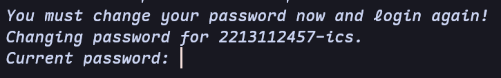
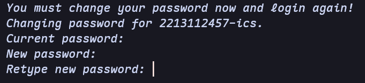
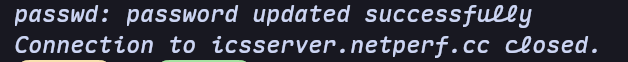

# ICS-Server

## 服务器配置

ICS课程团队准备了两台服务器，配置如下：

- `icsserver`（main）：位于兴庆，域名`icsserver.netperf.cc`，端口`2220`

- `vm-ics`（backup）：位于创新港，域名`igw.netperf.cc`，端口`2292`

!!! note
    由于某些原因，位于创新港的服务器无法访问外网（比如github等），只能访问交大内网，如需访问外网需要自行配置代理。同时，助教团队分发实验时也不会往第二台服务器分发。因此，建议大家**非必要不要选择第二台服务器**作为主力开发环境，仅用于备份或者紧急情况。

!!! danger
    严禁使用服务器进行挖矿或其他恶意占用服务器资源的行为，一经发现将进行**封号并严厉处罚**。

## 用户名和初始密码

用户名：你的学号加`-ics`

初始密码：你的学号

例如：你的学号是2213112457，那么你的服务器用户名就是：`2213112457-ics`，初始密码为：`2213112457`。

!!! danger
    为了防止信息泄露，首次登录输入初始密码后，服务器会**强制登录用户修改密码**。请同学们保管好自己修改后的密码，或者可自行尝试ssh密钥登录。

!!! note
    如果你发现你的账号不存在，忘记密码，或者无法正常登录等情况（比如密码被同学篡改或者在第一周开课之后才选上课），请立刻联系助教进行处理

## 首次登录

首次登录时，系统会强制要求改密码，必须使用**系统终端**进行第一次登录，直接使用VSCode等会报错**找不到tty**

常见系统的登录命令如下（注意将`username，`host`，`port`改成自己的用户名和目标服务器的真实域名和端口）：

=== "Windows"

    建议使用Windows自带的Powershell，使用如下命令登录：
    
    ```
    ssh username@host -p port
    ```
    
    例如用户名是`2213112457-ics`，选择第一台服务器，则实际命令为：

    ```
    ssh 2213112457-ics@icsserver.netperf.cc -p 2220
    ```

=== "MacOS"

    打开系统自带的 Terminal ，使用如下命令登录

    ```
    ssh username@host -p port
    ```

    例如用户名是`2213112457-ics`，选择第一台服务器，则实际命令为：

    ```
    ssh 2213112457-ics@icsserver.netperf.cc -p 2220
    ```

=== "Linux"

    打开终端软件，使用如下命令登录

    ```
    ssh username@host -p port
    ```

    例如用户名是`2213112457-ics`，选择第一台服务器，则实际命令为：

    ```
    ssh 2213112457-ics@icsserver.netperf.cc -p 2220
    ```

命令执行之后，系统会提示输入密码，此时输入**你的初始密码**即可。


!!!note
    输入密码的时候不会有回显，这是正常情况

成功登陆以后，系统会提示你需要**立刻修改密码**，否则登录是失败的：



这个时候需要首先输入当前的密码，也就是你自己的**初始密码**，输入成功之后，系统会提示修改密码：



此时才需要输入**自己想设置的新密码**，注意密码需要满足系统的要求（比如不能太短等）。

输入新密码之后，根据系统提示再重新输入一遍**自己设置的新密码**，匹配成功之后，会出现如下界面，说明登录成功。



后续再次登录时，输入**自己设置的新密码**即可登录成功。

## 登录成功检查

无论大家使用上述的什么方式尝试登录ICS-Server，在ICS-Server的终端中键入如下命令：

```
whoami
```

若显示你对应的用户名（比如`2213112457-ics`），则表明你登录ICS-Server成功且账号无误。

## 免密登录

SSH免密登录即**使用密钥**进行登录，可以免去输入密码的过程，大幅提升速度。

免密登录的过程包括**生成密钥**和**上传公钥到服务器**两个步骤。

首先打开系统终端，输入以下命令生成**一对公钥和私钥**：

```
ssh-keygen
```

之后一直按回车就行。

!!! note
    ssh-keygen可以设置很多命令行参数，感兴趣的同学可以自行探索

成功生成密钥之后，你会得到两个文件，其中带有`.pub`后缀的是公钥（比如`id_ed25519`和`id_ed25519.pub`）

接下来，将公钥上传至服务器。

如果是 MaxOS/Linux 系统，直接使用以下命令即可：

```
ssh-copy-id username@host -p port
```

如果是Windows系统，则需要手动将公钥内容复制到服务器的`~/.ssh/authorized_keys`文件中。

公钥上传成功之后，再次运行之前的登录命令，无需输入密码即可登录。

如果连登录命令都不想输入，可以将服务器的配置写入`~/.ssh/config`文件，以下内容作为参考：

```
Host ics
    HostName host
    User username
    IdentityFile ~/.ssh/id_ed25519
```

其中，Host字段可以随意设置，比如设为`ics`，HostName设置成服务器的**域名**，User设置成自己的**用户名**，IdentityFile设置成你自己的**私钥地址**。

后续直接输入`ssh ics`即可成功连接。

## 后续操作

成功使用系统终端登录之后，后续就可以在服务器上开发和探索了，可以参考如下文档：

- 使用vscode进行远程开发，参考[VSCode远程开发](../resources/VScodeRemote-SSH.md)

- Linux命令行学习与探索，参考[实用工具学习](../labs/lab0.md#实用工具学习)

- 常用命令大全，参考[Unix/Linux Command Reference :fontawesome-solid-file-pdf:](../assets/files/linux-command-reference.pdf)