# VSCode Remote-SSH Setting

## VSCode安装

[VSCode官网](https://code.visualstudio.com/)

大家自行从官网找到适合自己本机系统与机器的Release进行下载安装，不做更多解释。

## VSCode Remote-SSH插件安装

打开VSCode，你会看到如下的界面

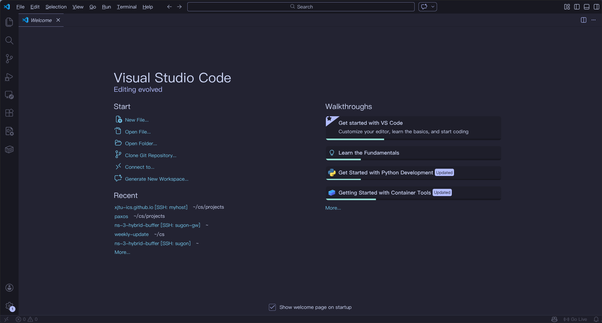

点击左侧”积木“按键，进入扩展商店，

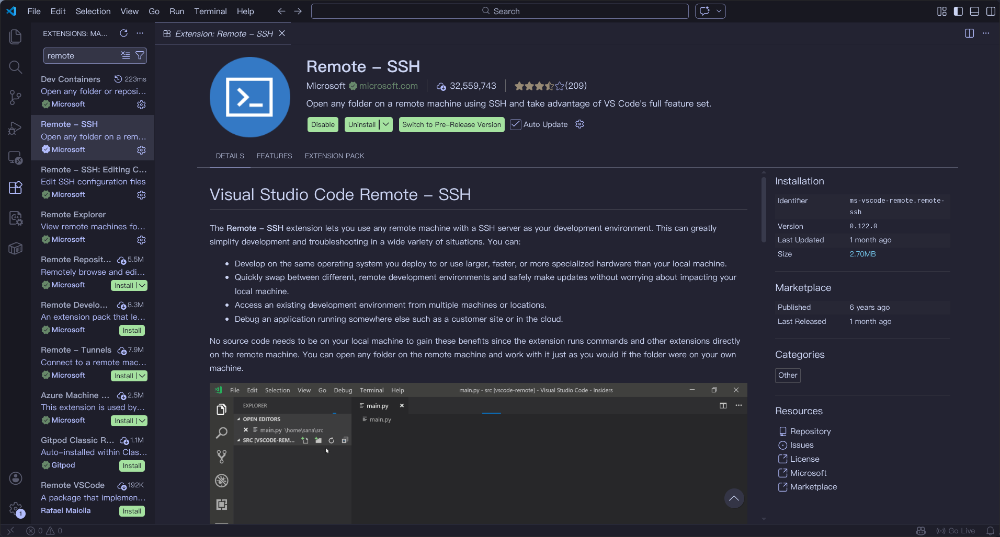

扩展商店中搜索Remote，安装Remote-SSH。

## 配置远程服务器信息

等待安装完成之后重新打开VSCode，你会看到一个小图标出现在侧边栏，这就是Remote-SSH，点开这个小图标，左侧会出现一个REMOTES的列表，其中SSH一栏底下会显示目前存在的服务器配置（通常根据`~/.ssh/config`生成）：

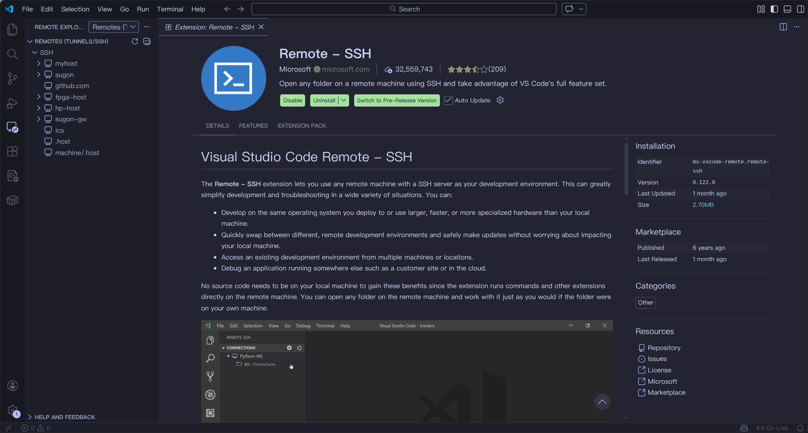

如果SSH列表下没有目标服务器，可以将鼠标移到SSH一栏上，点击SSH上的`+`添加远程服务器，按下后会跳出一个框框提示我们输入ssh相关的命令，我们按照之前[ICS-SERVER配置中](./ICS-Server.md)的ssh命令填入，这里以2213112457-ics为例：

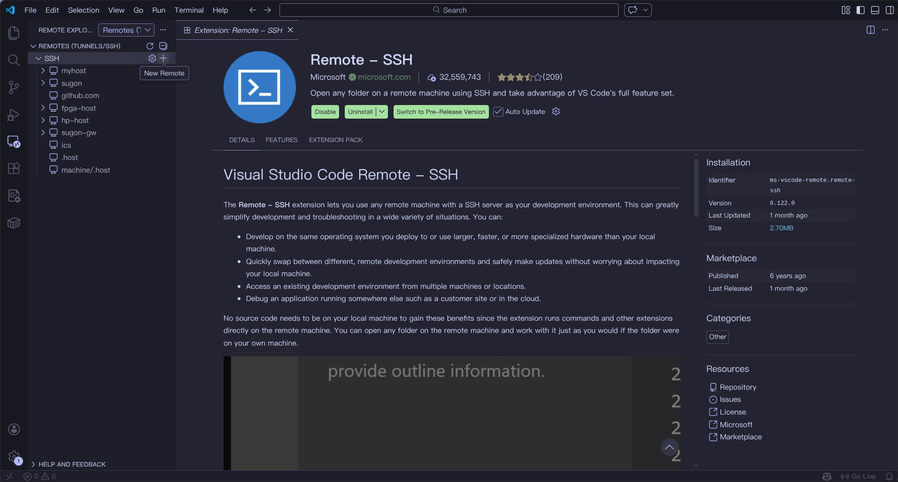

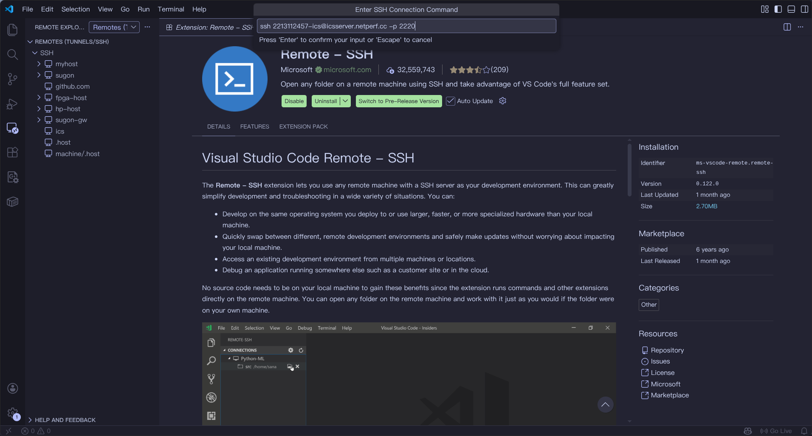

按下Enter后，会让我们选择哪个ssh配置文件进行保存，一般选择第一个默认的即可

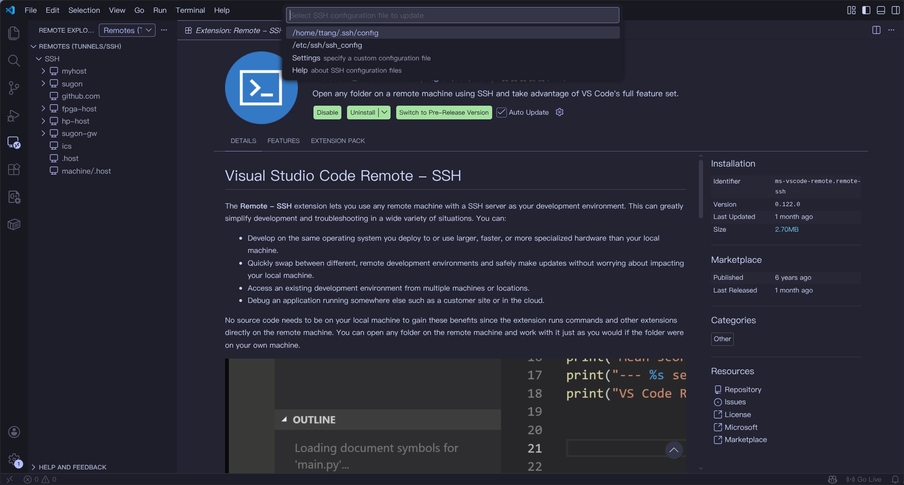

这样我们就保存成功了我们的服务器相关信息。此时会发现左侧的SSH列表出现了新的条目，就是我们刚刚添加的服务器信息，可以点击SSH栏上的⚙图标进行查看

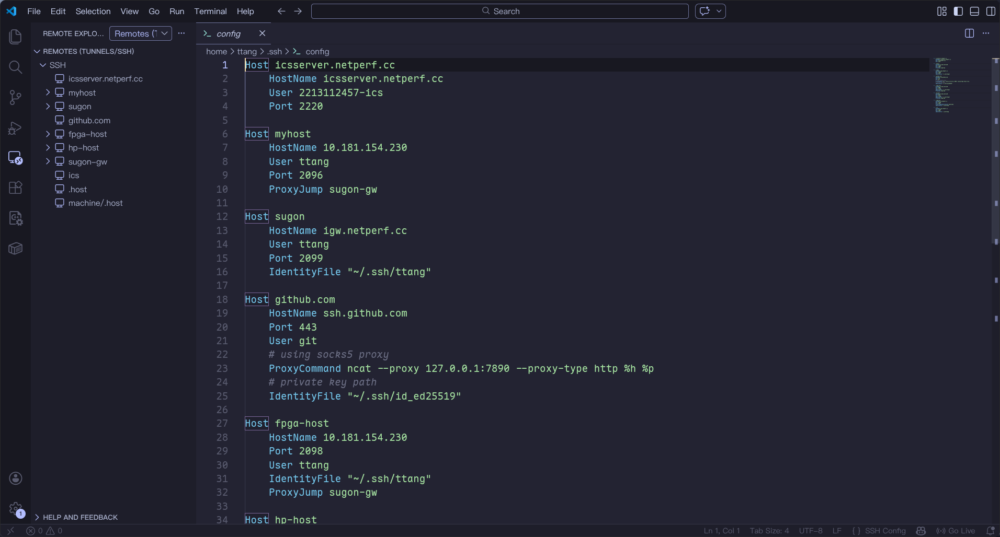

其中Host的值是可以随意更改的，vscode默认Host和HostName相同，即服务器的域名，如果觉得域名太长，可以将Host修改为短小的名字，比如`icsserver`

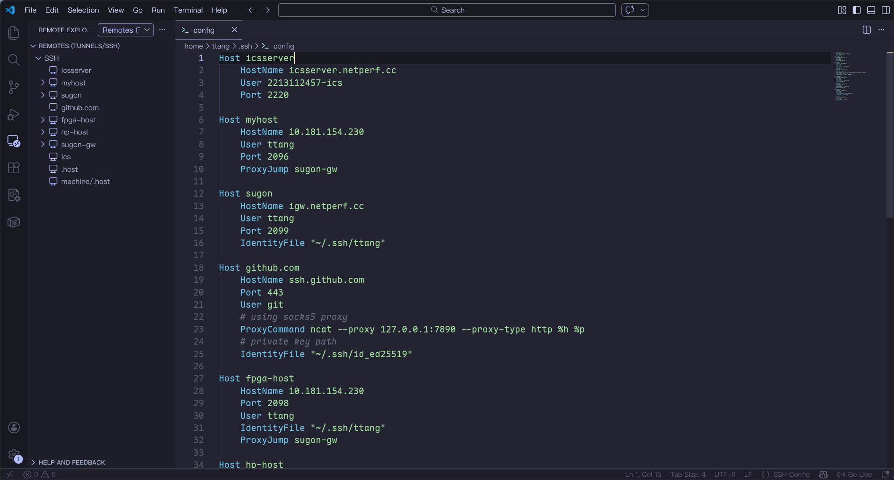

!!!note
    如果出现配置文件未生效等情况，可以尝试重启vscode

## 连接至远程服务器

将鼠标移到左侧SSH列表的目标服务器栏目上，右侧会出现两个按钮，其中→表示在当前窗口内打开，另一个则是新开一个vscode窗口，选择其中一个并点击。如果没有设置密钥，VSCode会新开一个窗口提醒你在框框内键入密码，你在需要在这个框框内键入服务器密码，键入后就可以连接服务器。

!!!note
    vscode可能会提示你选择目标platform，选择linux即可，因为目标服务器的系统是linux

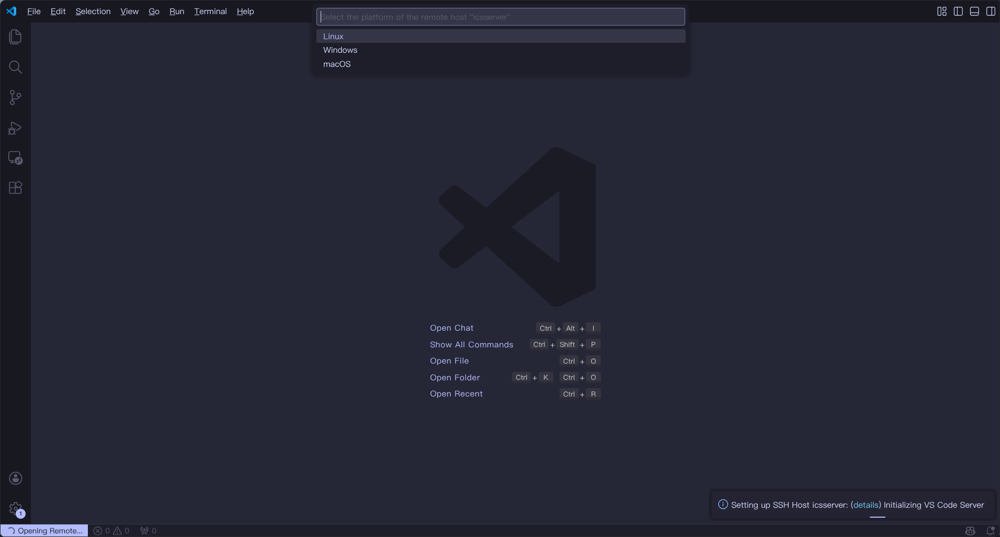

!!!warning
    注意这个密码一定是已经修改之后的密码，第一次登录时请**务必使用系统终端**进行登录

!!!note
    这里可能需要等待一会，因为需要在服务器端安装一些服务连接程序

连接完成之后点击侧边栏最上面的文件夹按钮，成功连接后会显示connetcted to remote，同时左下角也会显示对应的远程服务器的名字（即之前设置的Host）

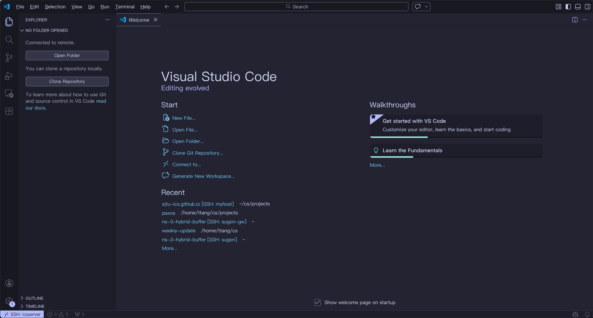

点击打开文件夹按钮，选择对应你要打开的文件夹，可以直接点击确定，此时会从你的home用户目录下打开。

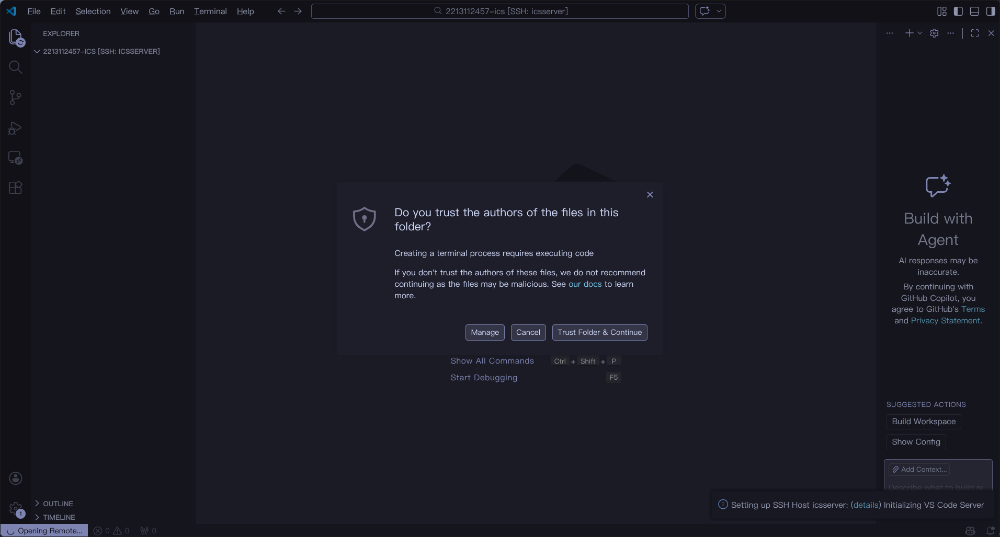

打开后，点击`trust folder & continue`，此时左边文件管理器会显示远程目录的内容，效果就像在本地开发一样，至此你就可以开始快乐的编辑与Coding！

如果需要退出，点击左下角的`SSH: Host`字段，并在弹出的下拉框中点击`close remote connection`即可，后续再连接时，左侧列表会自动保存之前打开的远程目录，十分方便

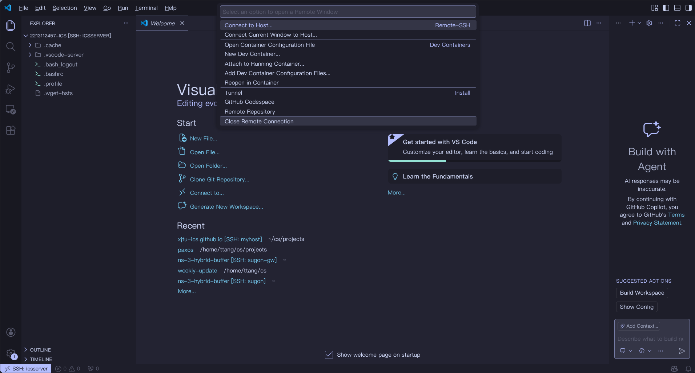

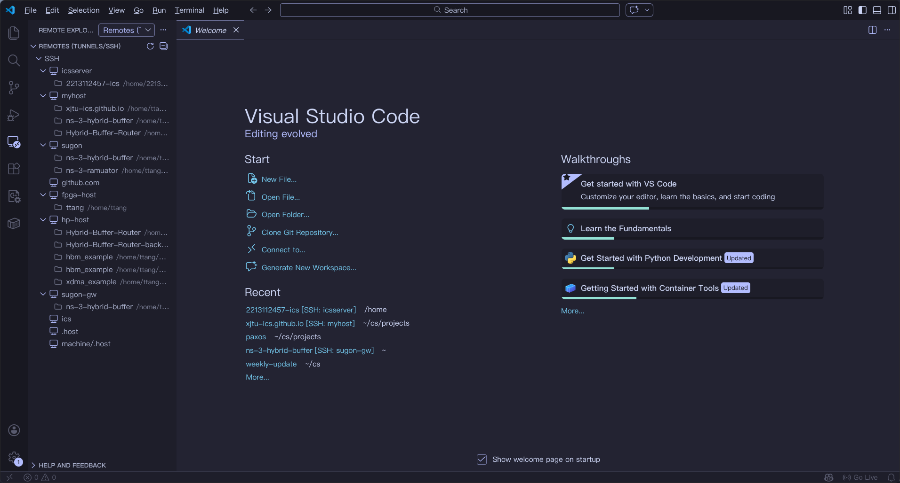

!!! note
    VSCode还有很多强大的功能与插件，可玩性高，这里不再做过多的介绍，大家可以自行探索并寻求最高效的开发方式。